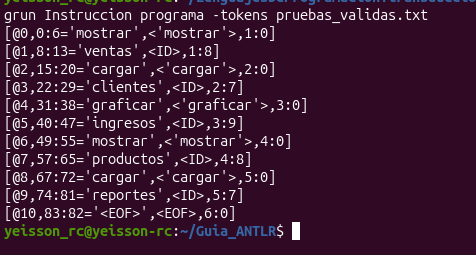
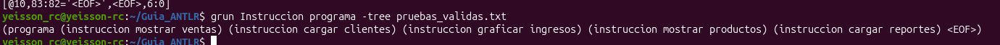
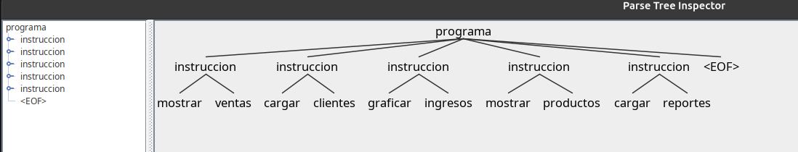
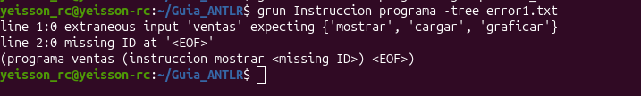
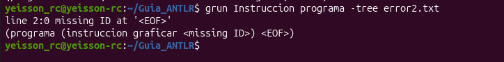
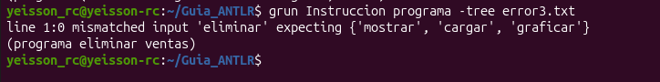

# Actividad práctica ANTLR 4 — Lenguaje de instrucciones

## Descripción
Se construyó un lenguaje simple con ANTLR 4 capaz de reconocer instrucciones del tipo:
`mostrar ventas`, `cargar clientes`, `graficar ingresos`.

## Archivo de gramática

Ver `Instruccion.g4`.

\`\`\`antlr
grammar Instruccion;

programa
    : instruccion+ EOF
    ;

instruccion
    : MOSTRAR ID
    | CARGAR ID
    | GRAFICAR ID
    ;

MOSTRAR
    : 'mostrar'
    ;

CARGAR
    : 'cargar'
    ;

GRAFICAR
    : 'graficar'
    ;

ID
    : [a-zA-Z]+
    ;

WS
    : [ \t\r\n]+ -> skip
    ;
\`\`\`

## Explicación de las reglas léxicas

- **MOSTRAR, CARGAR, GRAFICAR**: reconocen literalmente las palabras clave `mostrar`, `cargar` y `graficar`. Comienzan con mayúscula porque en ANTLR toda regla léxica (token) debe iniciar con letra mayúscula.
- **ID**: reconoce uno o más caracteres alfabéticos (`[a-zA-Z]+`), usado para los nombres que acompañan a cada instrucción (ventas, clientes, ingresos, etc.).
- **WS**: reconoce espacios, tabulaciones y saltos de línea, y usa `-> skip` para indicarle al lexer que los descarte y no los envíe al parser.

## Explicación de las reglas sintácticas

- **programa**: regla inicial. Indica que un programa válido está compuesto por una o más instrucciones (`instruccion+`) seguidas del fin de archivo (`EOF`). Esto permite procesar varias instrucciones en un mismo archivo de entrada.
- **instruccion**: define que cada instrucción válida es una palabra clave (`MOSTRAR`, `CARGAR` o `GRAFICAR`) seguida de un identificador (`ID`).

## Evidencia de tokens reconocidos

Archivo de entrada: `pruebas_validas.txt` (5 pruebas)

Comando ejecutado:
\`\`\`
grun Instruccion programa -tokens pruebas_validas.txt
\`\`\`

Resultado:
\`\`\`
[@0,0:6='mostrar',<'mostrar'>,1:0]
[@1,8:13='ventas',<ID>,1:8]
[@2,15:20='cargar',<'cargar'>,2:0]
[@3,22:29='clientes',<ID>,2:7]
[@4,31:38='graficar',<'graficar'>,3:0]
[@5,40:47='ingresos',<ID>,3:9]
[@6,49:55='mostrar',<'mostrar'>,4:0]
[@7,57:65='productos',<ID>,4:8]
[@8,67:72='cargar',<'cargar'>,5:0]
[@9,74:81='reportes',<ID>,5:7]
[@10,83:82='<EOF>',<EOF>,6:0]
\`\`\`

## Evidencia del árbol sintáctico

Comando ejecutado:
\`\`\`
grun Instruccion programa -tree pruebas_validas.txt
\`\`\`

Resultado:
\`\`\`
(programa (instruccion mostrar ventas) (instruccion cargar clientes) (instruccion graficar ingresos) (instruccion mostrar productos) (instruccion cargar reportes) <EOF>)
\`\`\`

## Casos de error identificados

**Error 1** — orden incorrecto de tokens (`error1.txt`: `ventas mostrar`)
\`\`\`
line 1:0 extraneous input 'ventas' expecting {'mostrar', 'cargar', 'graficar'}
line 2:0 missing ID at '<EOF>'
\`\`\`

**Error 2** — instrucción incompleta, falta el ID (`error2.txt`: `graficar`)
\`\`\`
line 2:0 missing ID at '<EOF>'
\`\`\`

**Error 3** — palabra clave no definida en la gramática (`error3.txt`: `eliminar ventas`)
\`\`\`
line 1:0 mismatched input 'eliminar' expecting {'mostrar', 'cargar', 'graficar'}
\`\`\`

## Conclusiones sobre la diferencia entre lexer y parser

El lexer y el parser cumplen roles distintos y complementarios dentro del proceso de análisis de un lenguaje. El lexer trabaja a nivel de caracteres: agrupa el texto crudo en unidades con significado (tokens) como palabras clave e identificadores, y descarta lo que no aporta estructura, como los espacios en blanco. El parser, en cambio, trabaja a nivel de tokens: verifica que la secuencia generada por el lexer cumpla con el orden y la estructura definidos por las reglas sintácticas de la gramática, y construye el árbol sintáctico que representa esa estructura. En otras palabras, el lexer responde "¿qué es cada pedazo de texto?" mientras que el parser responde "¿estos pedazos están organizados correctamente?". Esta separación permite que ambas etapas se diseñen y depuren de forma independiente, y es la base sobre la que se construyen compiladores e intérpretes.

## Preguntas de análisis

**1. ¿Cuál es la diferencia entre un lexema y un token?**
Un lexema es la secuencia de caracteres tal como aparece en el texto de entrada (por ejemplo, la palabra `mostrar`). Un token es la representación abstracta que el lexer le asigna a ese lexema, indicando a qué categoría pertenece (por ejemplo, `MOSTRAR`). Un mismo token puede corresponder a distintos lexemas (como `ID` puede ser `ventas`, `clientes`, etc.).

**2. ¿Cuál es la responsabilidad del lexer?**
Convertir la secuencia de caracteres del archivo de entrada en una secuencia de tokens, agrupando caracteres relacionados y descartando los que no son relevantes para el análisis (como espacios en blanco).

**3. ¿Cuál es la responsabilidad del parser?**
Recibir la secuencia de tokens generada por el lexer y verificar que cumpla con la estructura definida por las reglas sintácticas de la gramática, construyendo un árbol sintáctico que representa esa estructura.

**4. ¿Por qué las reglas léxicas comienzan con mayúscula en ANTLR?**
Es una convención de ANTLR que permite diferenciar automáticamente las reglas léxicas (tokens) de las reglas sintácticas dentro del mismo archivo de gramática.

**5. ¿Por qué las reglas sintácticas comienzan con minúscula?**
Por la misma convención: al iniciar con minúscula, ANTLR las identifica como reglas del parser, que combinan tokens para formar estructuras más complejas.

**6. ¿Cuál es la función de `->skip`?**
Le indica al lexer que, aunque reconoció un patrón (como espacios o saltos de línea), no debe generar un token para él ni enviarlo al parser; simplemente lo descarta.

**7. ¿Qué representa EOF?**
Representa el final del archivo de entrada (End Of File). Se usa en las reglas sintácticas para asegurar que toda la entrada fue consumida y reconocida correctamente, evitando que sobre texto sin procesar.

**8. ¿Qué información representa un árbol sintáctico?**
Representa la estructura jerárquica de la entrada según las reglas de la gramática: los nodos internos corresponden a reglas sintácticas aplicadas, y las hojas corresponden a los tokens reconocidos por el lexer.

**9. ¿Cuál es la diferencia entre Listener y Visitor?**
El Listener permite que ANTLR recorra automáticamente el árbol y dispare eventos (`enterX`/`exitX`) en cada nodo, sin que el desarrollador controle el orden del recorrido. El Visitor, en cambio, da control explícito: el propio desarrollador decide cuándo y cómo visitar cada nodo del árbol, lo cual es útil para tareas como evaluar expresiones o generar código.

**10. ¿Cómo podría utilizarse ANTLR para construir un lenguaje de dominio específico?**
Definiendo una gramática propia con las palabras clave, operadores y estructuras particulares del dominio (por ejemplo, comandos de un sistema de ventas), y usando ANTLR para generar el lexer y el parser que reconozcan ese lenguaje, sobre los cuales luego se implementa la lógica de interpretación o ejecución mediante Listener o Visitor.
