# Actividad ANTLR 4 — Gramática LL(1) para operaciones aritméticas y trigonométricas

Integrantes

* Camilo Bernal
* Diego Moreno
* Yeisson Rincón

## Requisitos

Para que el proyecto funcione se necesita:

* Linux (lo hicimos en Ubuntu)
* Python 3.8 o superior
* Java 11 o superior
* ANTLR 4.13.2 (el archivo `antlr-4.13.2-complete.jar` y el comando `antlr4`)
* El runtime de ANTLR para Python, en la misma versión que ANTLR:

```
pip install antlr4-python3-runtime==4.13.2
```

* Opcional, para ver el árbol sintáctico: `pip install antlr4-tools`

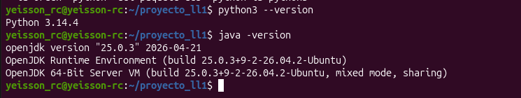

## ¿De qué trata la actividad?

La actividad consiste en diseñar e implementar una gramática LL(1) para un lenguaje pequeño que permite:

* Operaciones: `+`, `-`, `*`, `/`, `%` (también `mod`) y valor absoluto con `abs(x)` o `|x|`
* Funciones trigonométricas: `sin`, `cos`, `tan` (en radianes)
* Asignación de variables, por ejemplo `x = 2 + 3 * 4;`

ANTLR se encarga de generar el analizador léxico y sintáctico a partir de la gramática, y en Python hicimos la parte semántica, el manejo de errores y el cálculo de los conjuntos de Primeros, Siguientes y Predicción. Todas las entradas se leen desde archivos.

## Estructura del proyecto

```
proyecto_ll1/
├── Calculadora.g4      gramática (parte léxica y sintáctica)
├── generated/          código que genera ANTLR
├── errores.py          errores léxicos y sintácticos
├── semantico.py        análisis semántico (Visitor)
├── main.py             programa principal
├── conjuntos.py        Primeros, Siguientes y Predicción
├── entradas/           archivos de prueba
└── capturas/           capturas de la ejecución
```

## Cómo ejecutarlo

```
antlr4 -Dlanguage=Python3 -visitor -no-listener -o generated Calculadora.g4
python3 main.py entradas/correcto.txt
python3 conjuntos.py Calculadora.g4
```

## Paso a paso

### 1. Gramática

En `Calculadora.g4` están las reglas léxicas (en mayúscula) y las sintácticas (en minúscula). Para que sea LL(1) no tiene recursión por la izquierda, por eso las reglas quedan como `expr : term exprP` en vez de `expr : expr + term`. Las alternativas vacías son las producciones ε.

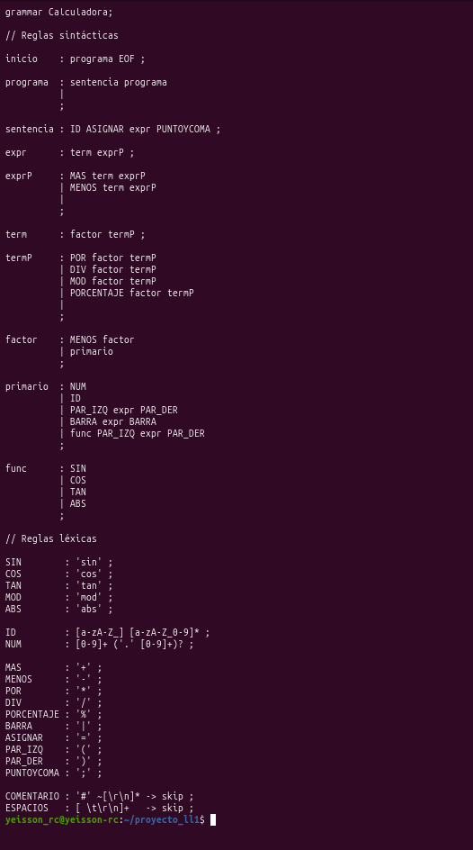

Con ANTLR generamos el lexer, el parser y el visitor en Python:

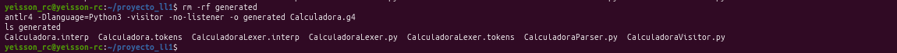

Probamos que ANTLR reconoce el lenguaje con el archivo `entradas/prueba.txt`:

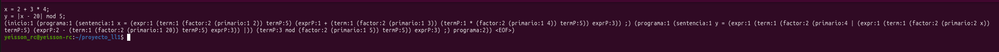

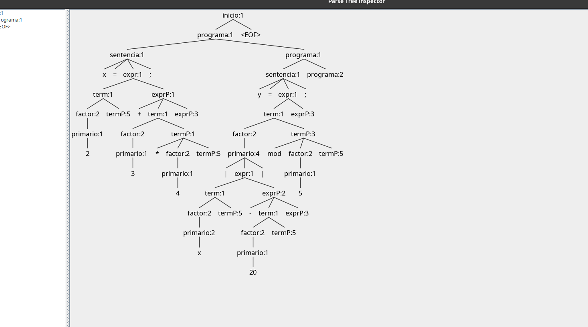

### 2. Errores léxicos y sintácticos

En `errores.py` reemplazamos los mensajes de error de ANTLR por unos en español, con línea y columna. Además los errores se guardan en una lista, y si hay alguno el programa no pasa a la parte semántica.

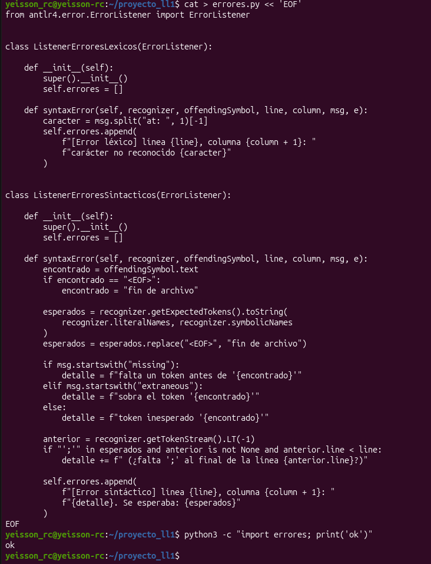

### 3. Análisis semántico

En `semantico.py` recorremos el árbol con un Visitor. Ahí se evalúan las expresiones, se guardan las variables en la tabla de símbolos y se detectan errores como variables no declaradas, división entre cero o módulo entre cero.

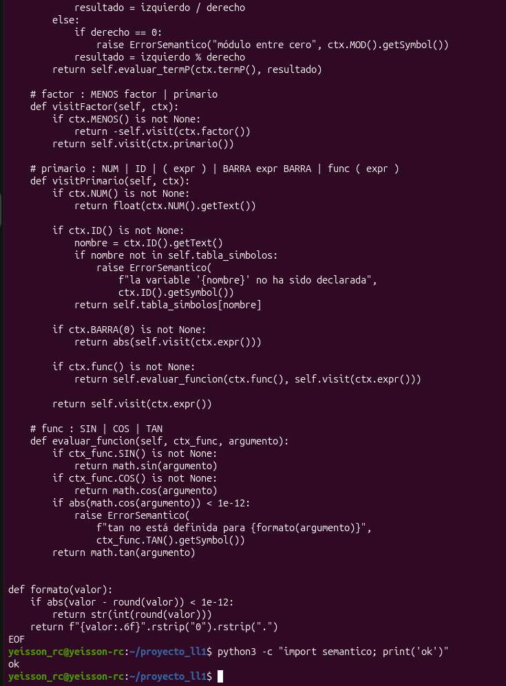

### 4. Programa principal

`main.py` recibe el archivo de entrada y ejecuta las tres fases en orden: léxica, sintáctica y semántica.

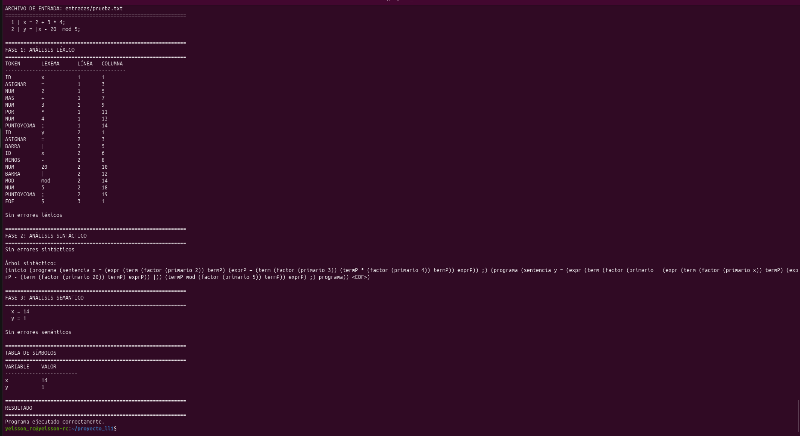

Código de `main.py`:

```python
import os
import sys

from antlr4 import CommonTokenStream, FileStream

from generated.CalculadoraLexer import CalculadoraLexer
from generated.CalculadoraParser import CalculadoraParser
from errores import ListenerErroresLexicos, ListenerErroresSintacticos
from semantico import AnalizadorSemantico, formato


def titulo(texto):
    print("\n" + "=" * 60)
    print(texto)
    print("=" * 60)


def main():
    if len(sys.argv) != 2:
        print("Uso: python3 main.py <archivo_de_entrada>")
        sys.exit(1)

    ruta = sys.argv[1]
    if not os.path.isfile(ruta):
        print(f"Error: no existe el archivo '{ruta}'")
        sys.exit(1)

    titulo(f"ARCHIVO DE ENTRADA: {ruta}")
    with open(ruta, encoding="utf-8") as f:
        for n, linea in enumerate(f.read().splitlines(), 1):
            print(f"{n:>3} | {linea}")

    entrada = FileStream(ruta, encoding="utf-8")

    # Fase 1: léxico
    titulo("FASE 1: ANÁLISIS LÉXICO")
    lexer = CalculadoraLexer(entrada)
    lexer.removeErrorListeners()
    errores_lex = ListenerErroresLexicos()
    lexer.addErrorListener(errores_lex)

    tokens = CommonTokenStream(lexer)
    tokens.fill()

    print(f"{'TOKEN':<12}{'LEXEMA':<12}{'LÍNEA':<8}{'COLUMNA'}")
    print("-" * 40)
    for tok in tokens.tokens:
        if tok.type == -1:
            nombre, lexema = "EOF", "$"
        else:
            nombre, lexema = CalculadoraLexer.symbolicNames[tok.type], tok.text
        print(f"{nombre:<12}{lexema:<12}{tok.line:<8}{tok.column + 1}")

    if errores_lex.errores:
        print()
        for err in errores_lex.errores:
            print(err)
    else:
        print("\nSin errores léxicos")

    # Fase 2: sintáctico
    titulo("FASE 2: ANÁLISIS SINTÁCTICO")
    parser = CalculadoraParser(tokens)
    parser.removeErrorListeners()
    errores_sin = ListenerErroresSintacticos()
    parser.addErrorListener(errores_sin)

    arbol = parser.inicio()

    if errores_sin.errores:
        for err in errores_sin.errores:
            print(err)
    else:
        print("Sin errores sintácticos")
        print("\nÁrbol sintáctico:")
        print(arbol.toStringTree(recog=parser))

    if errores_lex.errores or errores_sin.errores:
        titulo("RESULTADO")
        print("Hay errores léxicos o sintácticos; no se realiza el análisis semántico.")
        sys.exit(1)

    # Fase 3: semántico
    titulo("FASE 3: ANÁLISIS SEMÁNTICO")
    semantico = AnalizadorSemantico()
    semantico.visit(arbol)

    if semantico.errores:
        print()
        for err in semantico.errores:
            print(err)
    else:
        print("\nSin errores semánticos")

    titulo("TABLA DE SÍMBOLOS")
    print(f"{'VARIABLE':<12}{'VALOR'}")
    print("-" * 24)
    for nombre, valor in semantico.tabla_simbolos.items():
        print(f"{nombre:<12}{formato(valor)}")

    titulo("RESULTADO")
    if semantico.errores:
        print("El programa tiene errores semánticos.")
        sys.exit(1)
    print("Programa ejecutado correctamente.")


if __name__ == "__main__":
    main()
```

### 5. Pruebas

Programa correcto con todas las operaciones:

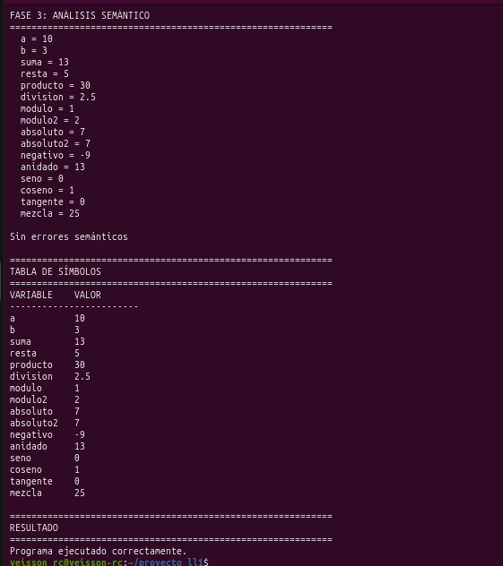

Error léxico (caracteres que no pertenecen al lenguaje):

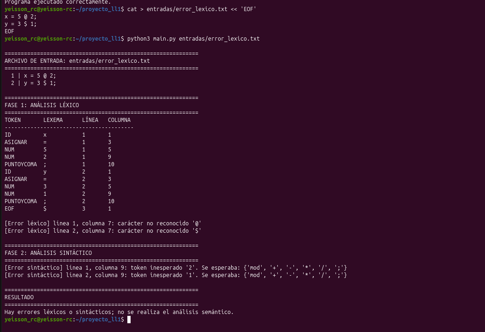

Errores sintácticos (falta `;`, falta `)` y operador sin operando):

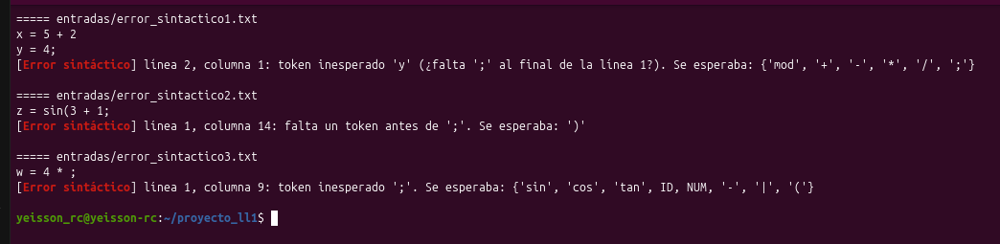

Errores semánticos (variable no declarada, división y módulo entre cero):

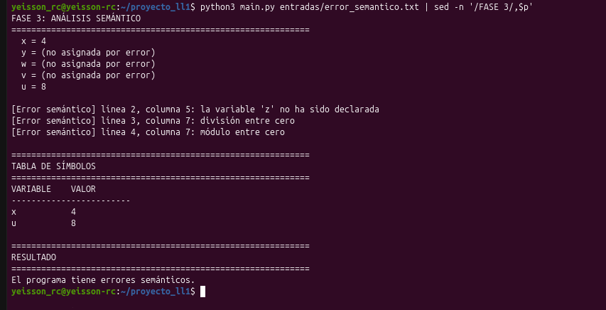

### 6. Conjuntos de Primeros, Siguientes y Predicción

`conjuntos.py` lee la gramática directamente del archivo `Calculadora.g4`, calcula los tres conjuntos y revisa que los conjuntos de predicción de cada no terminal no tengan elementos en común, que es la condición para que la gramática sea LL(1).

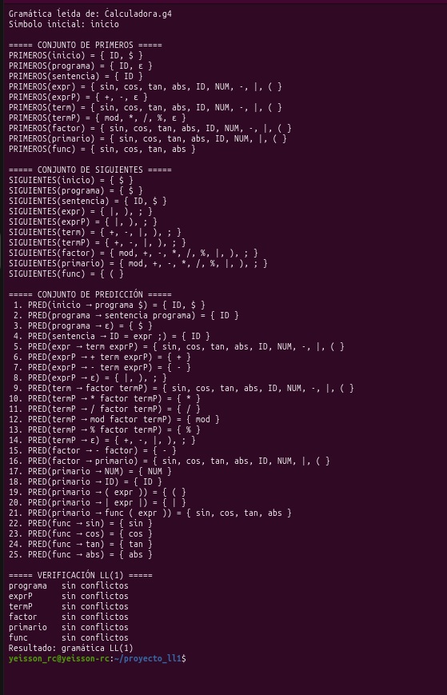

Código de `conjuntos.py`:

```python
import re
import sys

EPS = "ε"
FIN = "$"


def leer_gramatica(ruta):
    with open(ruta, encoding="utf-8") as f:
        texto = f.read()

    texto = re.sub(r"/\*.*?\*/", "", texto, flags=re.DOTALL)
    texto = re.sub(r"//[^\n]*", "", texto)
    texto = re.sub(r"^\s*grammar\s+\w+\s*;", "", texto, flags=re.MULTILINE)

    reglas = re.findall(r"([A-Za-z_]\w*)\s*:((?:'[^']*'|[^;'])*);", texto)

    gramatica = {}
    literales = {}
    orden_terminales = []

    for nombre, cuerpo in reglas:
        cuerpo = cuerpo.strip()
        if nombre[0].isupper():
            if "-> skip" in cuerpo:
                continue
            orden_terminales.append(nombre)
            literal = re.fullmatch(r"'([^']*)'", cuerpo)
            if literal:
                literales[nombre] = literal.group(1)
        else:
            producciones = []
            for alternativa in cuerpo.split("|"):
                simbolos = alternativa.split()
                simbolos = [FIN if s == "EOF" else s for s in simbolos]
                producciones.append(simbolos if simbolos else [EPS])
            gramatica[nombre] = producciones

    return gramatica, literales, orden_terminales + [FIN]


def primeros_de(secuencia, primeros, gramatica):
    resultado = set()
    for simbolo in secuencia:
        if simbolo == EPS:
            continue
        if simbolo not in gramatica:
            resultado.add(simbolo)
            return resultado
        resultado |= primeros[simbolo] - {EPS}
        if EPS not in primeros[simbolo]:
            return resultado
    resultado.add(EPS)
    return resultado


def calcular_primeros(gramatica):
    primeros = {A: set() for A in gramatica}
    cambio = True
    while cambio:
        cambio = False
        for A, producciones in gramatica.items():
            for prod in producciones:
                nuevos = primeros_de(prod, primeros, gramatica)
                if not nuevos <= primeros[A]:
                    primeros[A] |= nuevos
                    cambio = True
    return primeros


def calcular_siguientes(gramatica, primeros, inicial):
    siguientes = {A: set() for A in gramatica}
    siguientes[inicial].add(FIN)
    cambio = True
    while cambio:
        cambio = False
        for A, producciones in gramatica.items():
            for prod in producciones:
                for i, B in enumerate(prod):
                    if B not in gramatica:
                        continue
                    resto = primeros_de(prod[i + 1:], primeros, gramatica)
                    nuevos = resto - {EPS}
                    if EPS in resto:
                        nuevos |= siguientes[A]
                    if not nuevos <= siguientes[B]:
                        siguientes[B] |= nuevos
                        cambio = True
    return siguientes


def calcular_prediccion(gramatica, primeros, siguientes):
    prediccion = []
    for A, producciones in gramatica.items():
        for prod in producciones:
            prim = primeros_de(prod, primeros, gramatica)
            pred = prim - {EPS}
            if EPS in prim:
                pred |= siguientes[A]
            prediccion.append((A, prod, pred))
    return prediccion


def buscar_conflictos(gramatica, prediccion):
    conflictos = []
    for A in gramatica:
        reglas = [(prod, pred) for (nt, prod, pred) in prediccion if nt == A]
        for i in range(len(reglas)):
            for j in range(i + 1, len(reglas)):
                comun = reglas[i][1] & reglas[j][1]
                if comun:
                    conflictos.append((A, reglas[i][0], reglas[j][0], comun))
    return conflictos


def main():
    ruta = sys.argv[1] if len(sys.argv) > 1 else "Calculadora.g4"
    gramatica, literales, orden = leer_gramatica(ruta)
    inicial = next(iter(gramatica))

    def mostrar(simbolo):
        return literales.get(simbolo, simbolo)

    def conjunto(c):
        return "{ " + ", ".join(mostrar(t) for t in orden + [EPS] if t in c) + " }"

    def regla(A, prod):
        return f"{A} → {' '.join(mostrar(s) for s in prod)}"

    primeros = calcular_primeros(gramatica)
    siguientes = calcular_siguientes(gramatica, primeros, inicial)
    prediccion = calcular_prediccion(gramatica, primeros, siguientes)
    conflictos = buscar_conflictos(gramatica, prediccion)

    print(f"Gramática leída de: {ruta}")
    print(f"Símbolo inicial: {inicial}")

    print("\n===== CONJUNTO DE PRIMEROS =====")
    for A in gramatica:
        print(f"PRIMEROS({A}) = {conjunto(primeros[A])}")

    print("\n===== CONJUNTO DE SIGUIENTES =====")
    for A in gramatica:
        print(f"SIGUIENTES({A}) = {conjunto(siguientes[A])}")

    print("\n===== CONJUNTO DE PREDICCIÓN =====")
    for n, (A, prod, pred) in enumerate(prediccion, 1):
        print(f"{n:>2}. PRED({regla(A, prod)}) = {conjunto(pred)}")

    print("\n===== VERIFICACIÓN LL(1) =====")
    for A, producciones in gramatica.items():
        if len(producciones) < 2:
            continue
        propios = [c for c in conflictos if c[0] == A]
        if propios:
            comun = set().union(*(c[3] for c in propios))
            print(f"{A:<10} conflicto en {conjunto(comun)}")
        else:
            print(f"{A:<10} sin conflictos")
    print("Resultado:", "no es LL(1)" if conflictos else "gramática LL(1)")

if __name__ == "__main__":
    main()
```
