# Actividad ANTLR 4 — Gramática LL(1) para operaciones aritméticas y trigonométricas

Integrantes

* Camilo Bernal
* Diego Moreno
* Yeisson Rincón

## Requisitos

Para que el proyecto funcione se necesita:

* Linux (lo hicimos en Ubuntu)
* Python 3.8 o superior
* Java 11 o superior
* ANTLR 4.13.2 (el archivo `antlr-4.13.2-complete.jar` y el comando `antlr4`)
* El runtime de ANTLR para Python, en la misma versión que ANTLR:

```
pip install antlr4-python3-runtime==4.13.2
```

* Opcional, para ver el árbol sintáctico: `pip install antlr4-tools`

<p align="center">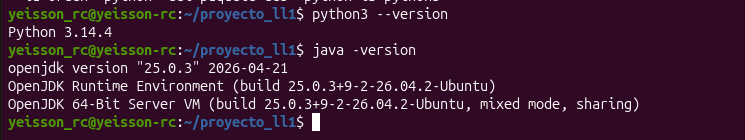</p>

## ¿De qué trata la actividad?

La actividad consiste en diseñar e implementar una gramática LL(1) para un lenguaje pequeño que permite:

* Operaciones: `+`, `-`, `*`, `/`, `%` (también `mod`) y valor absoluto con `abs(x)` o `|x|`
* Funciones trigonométricas: `sin`, `cos`, `tan` (en radianes)
* Asignación de variables, por ejemplo `x = 2 + 3 * 4;`

ANTLR se encarga de generar el analizador léxico y sintáctico a partir de la gramática, y en Python hicimos la parte semántica, el manejo de errores y el cálculo de los conjuntos de Primeros, Siguientes y Predicción. Todas las entradas se leen desde archivos.

## Estructura del proyecto

```
proyecto_ll1/
├── Calculadora.g4      gramática (parte léxica y sintáctica)
├── errores.py          errores léxicos y sintácticos
├── semantico.py        análisis semántico (Visitor)
├── main.py             programa principal
├── conjuntos.py        Primeros, Siguientes y Predicción
├── entradas/           archivos de prueba
└── capturas/           capturas de la ejecución
```

## Cómo ejecutarlo

```
python3 main.py entradas/correcto.txt
python3 conjuntos.py Calculadora.g4
```

## Paso a paso

### 1. Gramática

En `Calculadora.g4` están las reglas léxicas (en mayúscula) y las sintácticas (en minúscula). Para que sea LL(1) no tiene recursión por la izquierda, por eso las reglas quedan como `expr : term exprP` en vez de `expr : expr + term`. Las alternativas vacías son las producciones ε.

<p align="center">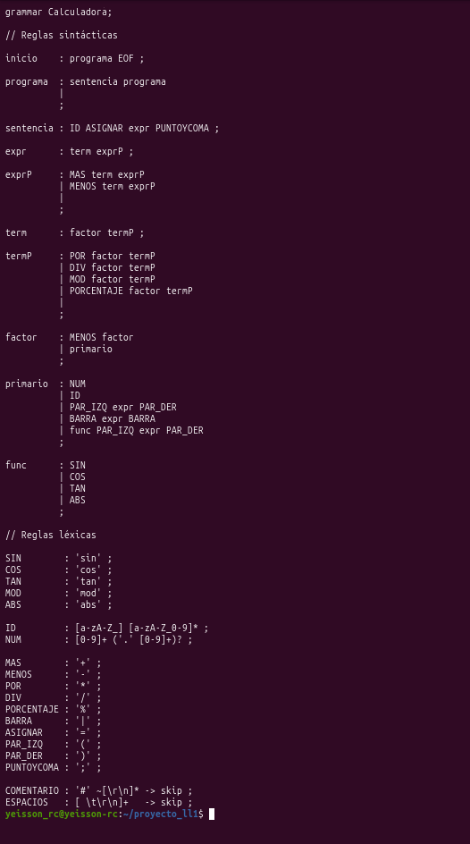</p>

Con ANTLR generamos el lexer, el parser y el visitor en Python:

<p align="center">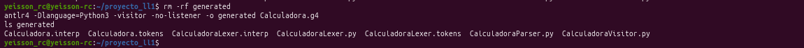</p>

Probamos que ANTLR reconoce el lenguaje con el archivo `entradas/prueba.txt`:

<p align="center">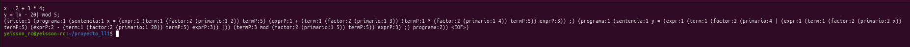</p>

<p align="center">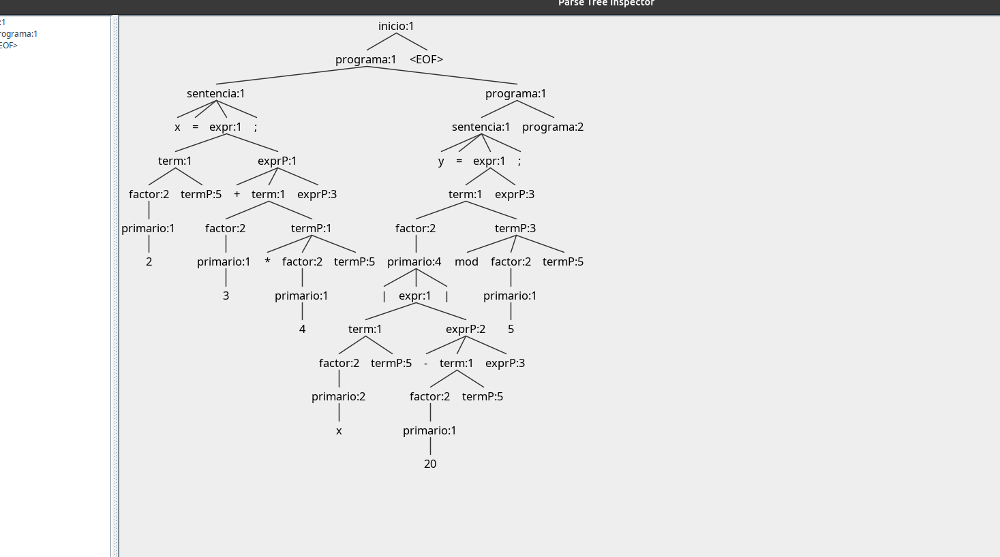</p>

### 2. Errores léxicos y sintácticos

En `errores.py` reemplazamos los mensajes de error de ANTLR por unos en español, con línea y columna. Además los errores se guardan en una lista, y si hay alguno el programa no pasa a la parte semántica.

<p align="center">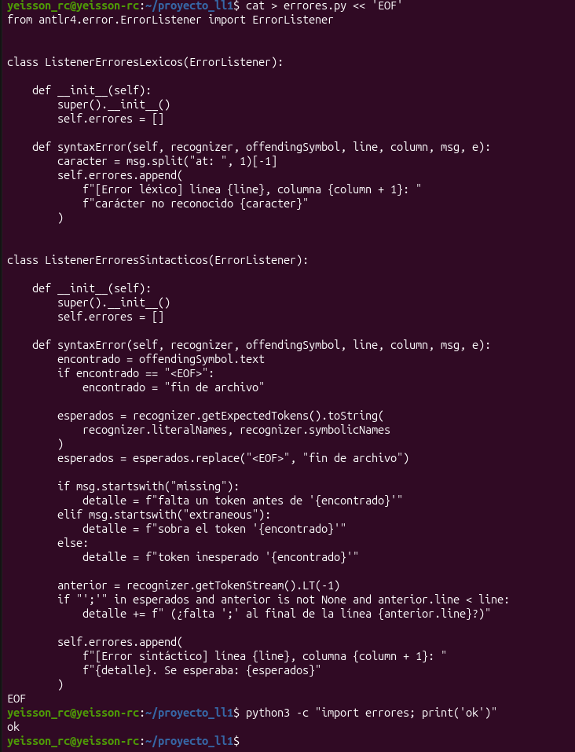</p>

### 3. Análisis semántico

En `semantico.py` recorremos el árbol con un Visitor. Ahí se evalúan las expresiones, se guardan las variables en la tabla de símbolos y se detectan errores como variables no declaradas, división entre cero o módulo entre cero.

<p align="center">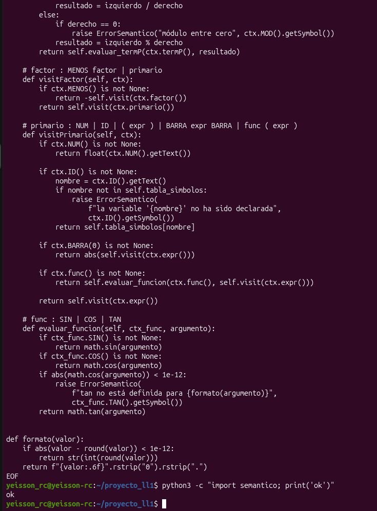</p>

### 4. Programa principal

`main.py` recibe el archivo de entrada y ejecuta las tres fases en orden: léxica, sintáctica y semántica.

<p align="center">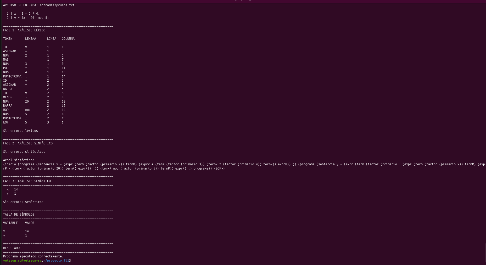</p>

### 5. Pruebas

Programa correcto con todas las operaciones:

<p align="center">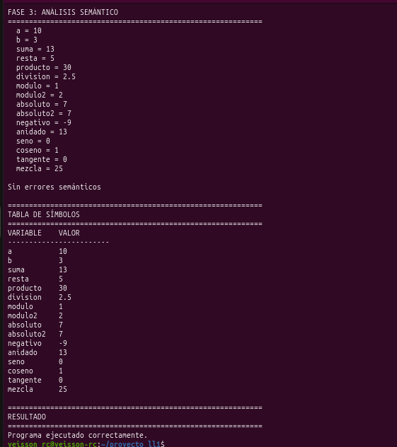</p>

Error léxico (caracteres que no pertenecen al lenguaje):

<p align="center">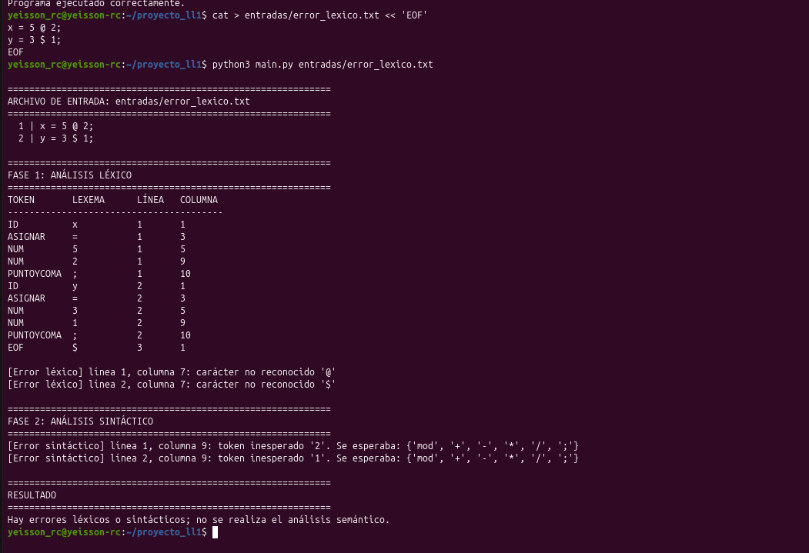</p>

Errores sintácticos (falta `;`, falta `)` y operador sin operando):

<p align="center">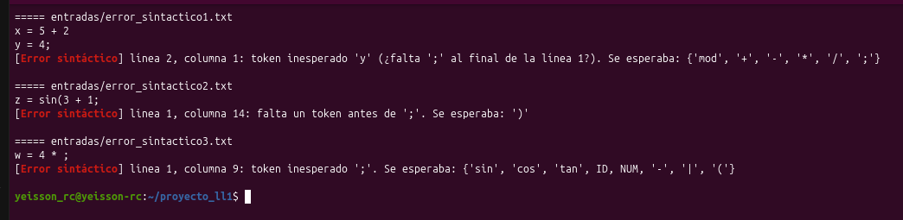</p>

Errores semánticos (variable no declarada, división y módulo entre cero):

<p align="center">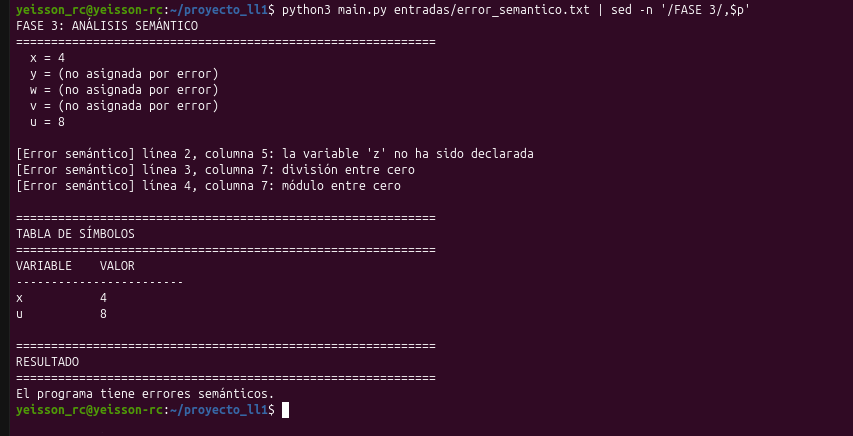</p>

### 6. Conjuntos de Primeros, Siguientes y Predicción

`conjuntos.py` lee la gramática directamente del archivo `Calculadora.g4`, calcula los tres conjuntos y revisa que los conjuntos de predicción de cada no terminal no tengan elementos en común, que es la condición para que la gramática sea LL(1).

<p align="center">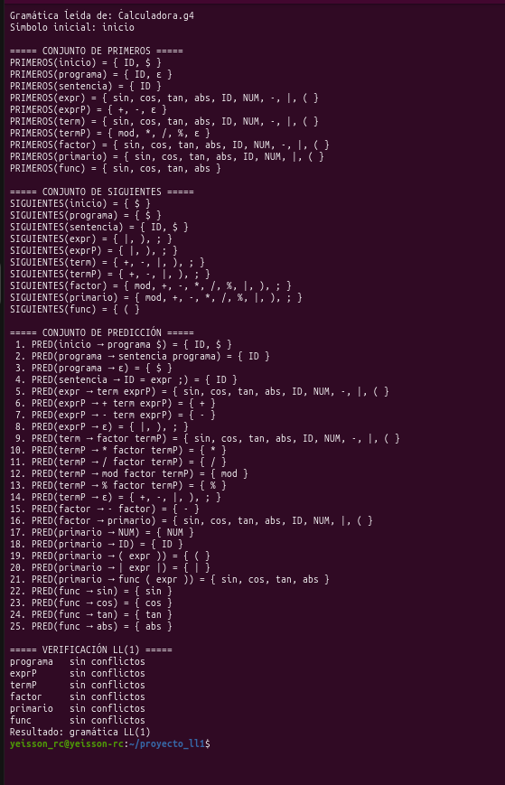</p>
