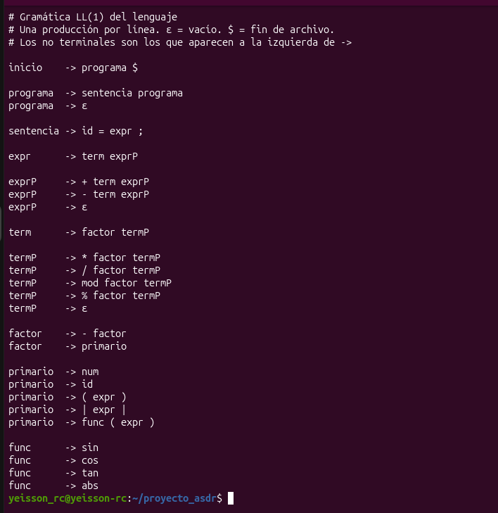
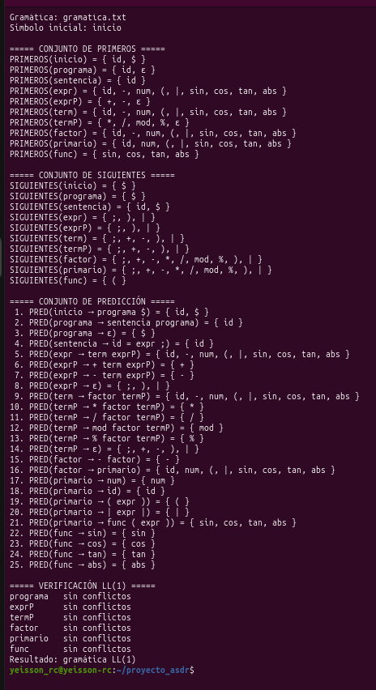
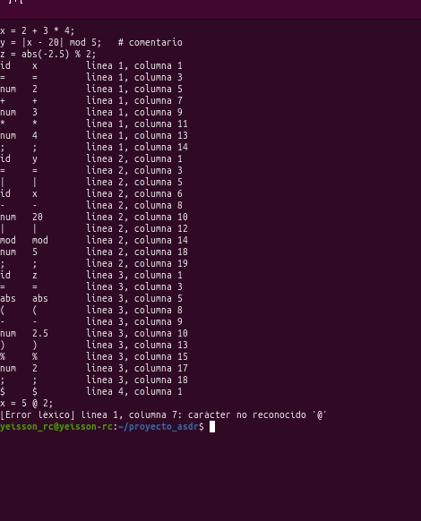
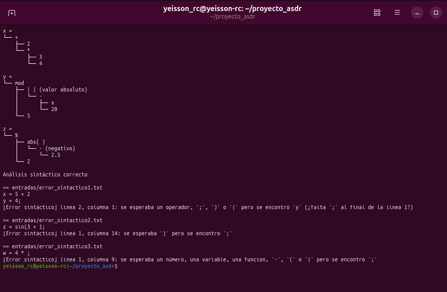
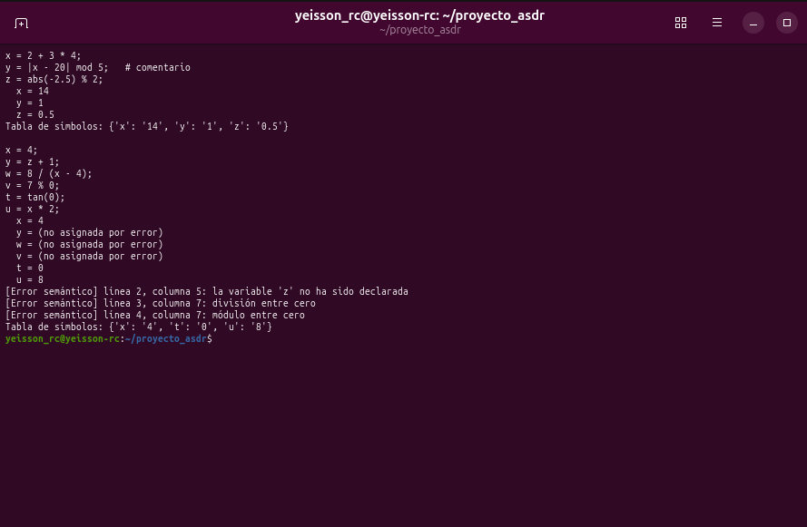
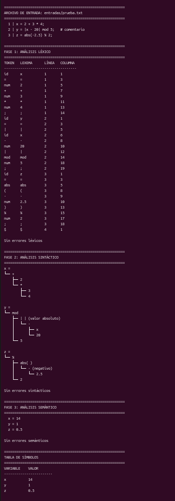
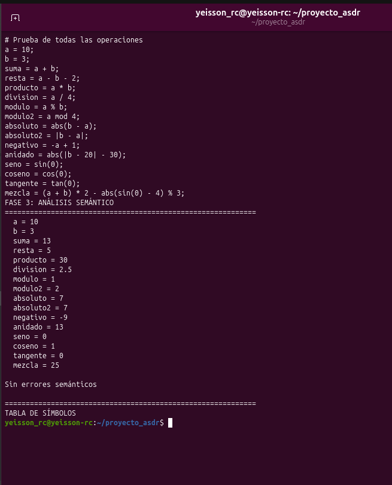
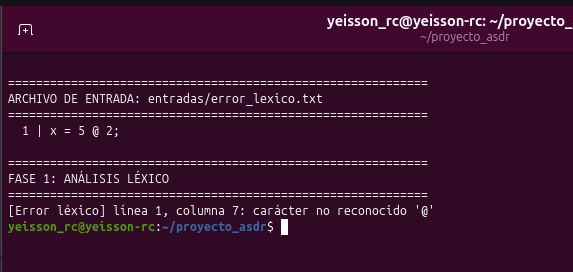
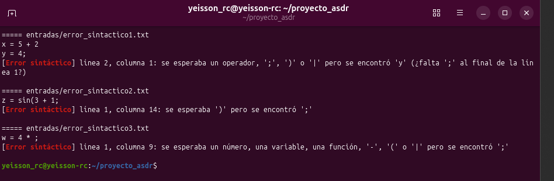
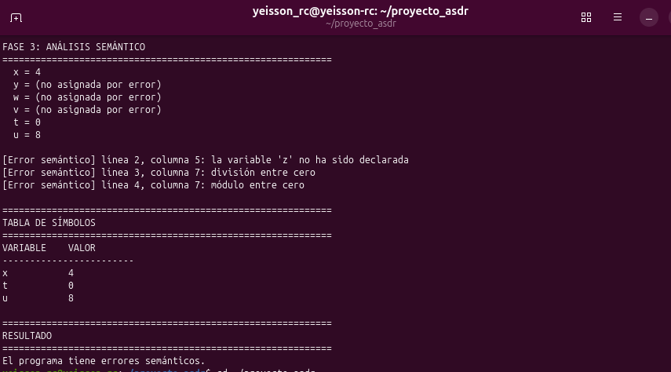

# Actividad LL(1) — Analizador sintáctico descendente recursivo

Integrantes

* Camilo Bernal
* Diego Moreno
* Yeisson Rincón

## Requisitos

Solo se necesita **Python 3.8 o superior**. No se usa ninguna librería externa ni ANTLR: el analizador léxico, el sintáctico y el semántico están escritos a mano.

## ¿De qué trata la actividad?

Diseñar e implementar una gramática LL(1) para un lenguaje que permite:

* Operaciones: `+`, `-`, `*`, `/`, `%` (también `mod`) y valor absoluto con `abs(x)` o `|x|`
* Funciones trigonométricas: `sin`, `cos`, `tan` (en radianes)
* Asignación de variables, por ejemplo `x = 2 + 3 * 4;`

El programa garantiza las tres fases (léxica, sintáctica y semántica), muestra los conjuntos de Primeros, Siguientes y Predicción, y lee el código fuente desde un archivo `.txt`.

El analizador sintáctico es un **analizador descendente recursivo (ASDR)**: tiene una función por cada no terminal de la gramática, y en cada una decide qué regla aplicar mirando **un solo token**, según los conjuntos de predicción.

## Estructura del proyecto

```
proyecto_asdr/
├── gramatica.txt     gramática LL(1), una producción por línea
├── conjuntos.py      Primeros, Siguientes, Predicción y verificación LL(1)
├── lexico.py         analizador léxico: entrega un token a la vez
├── parser.py         analizador sintáctico descendente recursivo
├── semantico.py      evaluación, tabla de símbolos y errores semánticos
├── main.py           recibe el .txt y ejecuta las tres fases en orden
├── entradas/         programas de prueba
└── capturas/         capturas de la ejecución
```

## Cómo ejecutarlo

```
python3 conjuntos.py gramatica.txt
python3 main.py entradas/correcto.txt
```

## Paso a paso

### 1. Gramática

La gramática está en `gramatica.txt`, con una producción por línea. No tiene recursión por la izquierda: en lugar de `expr → expr + term` se usa `expr → term exprP` y `exprP → + term exprP | ε`. La precedencia sale de los niveles: `expr` (suma y resta) usa `term` (multiplicación, división y módulo), que usa `factor` (menos unario), que usa `primario` (números, variables, paréntesis, valor absoluto y funciones).



### 2. Conjuntos Primeros, Siguientes y Predicción

`conjuntos.py` lee `gramatica.txt` y calcula los tres conjuntos con el algoritmo de punto fijo: empieza con conjuntos vacíos y recorre las reglas hasta que ninguno cambie. Luego revisa que, para cada no terminal, los conjuntos de predicción de sus reglas no tengan elementos en común, que es la condición para que la gramática sea LL(1).



### 3. Analizador léxico

`lexico.py` recorre el texto y lo agrupa en tokens. Cada llamada a `siguiente()` entrega un solo token. El tipo de cada token es el mismo nombre del terminal en la gramática (`id`, `num`, `+`, `sin`, `$`…). Ignora espacios y comentarios (`#`) y reporta los caracteres que no pertenecen al lenguaje.



### 4. Analizador sintáctico

`parser.py` tiene una función por cada no terminal. Cada `if` corresponde a un conjunto de predicción: si el token actual está en el PRED de una regla, se aplica esa regla. `emparejar()` consume el token esperado y pide el siguiente al léxico. Al final se comprueba que el siguiente token sea el fin de archivo. Si hay un error sintáctico, se detiene e indica qué se esperaba y qué se encontró.

`exprP` y `termP` reciben lo construido a la izquierda y lo van acumulando, así `10 - 3 - 2` se agrupa como `(10 - 3) - 2` y se respeta la asociatividad izquierda.



### 5. Análisis semántico

`semantico.py` recorre los árboles que construyó el parser, evalúa cada expresión y guarda las variables en la tabla de símbolos. Detecta variables no declaradas, división entre cero, módulo entre cero y `tan` indefinida. Si una sentencia tiene error, lo reporta y sigue con la siguiente.



### 6. Programa principal

`main.py` recibe el archivo `.txt` y ejecuta las tres fases en orden. Si una fase encuentra errores, no pasa a la siguiente.



### 7. Pruebas de implementación

Programa correcto con todas las operaciones:



Error léxico:



Errores sintácticos (falta `;`, falta `)` y falta un operando):



Errores semánticos (variable no declarada, división y módulo entre cero):



## Código

### `gramatica.txt`

```
# Gramática LL(1) del lenguaje
# Una producción por línea. ε = vacío. $ = fin de archivo.
# Los no terminales son los que aparecen a la izquierda de ->

inicio    -> programa $

programa  -> sentencia programa
programa  -> ε

sentencia -> id = expr ;

expr      -> term exprP

exprP     -> + term exprP
exprP     -> - term exprP
exprP     -> ε

term      -> factor termP

termP     -> * factor termP
termP     -> / factor termP
termP     -> mod factor termP
termP     -> % factor termP
termP     -> ε

factor    -> - factor
factor    -> primario

primario  -> num
primario  -> id
primario  -> ( expr )
primario  -> | expr |
primario  -> func ( expr )

func      -> sin
func      -> cos
func      -> tan
func      -> abs
```

### `conjuntos.py`

```python
import os
import sys

EPS = "ε"
FIN = "$"


def leer_gramatica(ruta):
    reglas = []
    with open(ruta, encoding="utf-8") as f:
        for n, linea in enumerate(f, 1):
            linea = linea.strip()
            if not linea or linea.startswith("#"):
                continue
            if "->" not in linea:
                print(f"Error en la línea {n} de la gramática: falta '->'")
                sys.exit(1)
            izquierda, derecha = linea.split("->", 1)
            simbolos = derecha.split()
            reglas.append((izquierda.strip(), simbolos if simbolos else [EPS]))

    no_terminales = []
    for A, _ in reglas:
        if A not in no_terminales:
            no_terminales.append(A)

    terminales = []
    for _, prod in reglas:
        for s in prod:
            if s not in no_terminales and s != EPS and s not in terminales:
                terminales.append(s)
    if FIN in terminales:
        terminales.remove(FIN)
    terminales.append(FIN)

    return reglas, no_terminales, terminales


def primeros_de(secuencia, primeros):
    resultado = set()
    for s in secuencia:
        if s == EPS:
            continue
        if s not in primeros:
            resultado.add(s)
            return resultado
        resultado |= primeros[s] - {EPS}
        if EPS not in primeros[s]:
            return resultado
    resultado.add(EPS)
    return resultado


def calcular_primeros(reglas, no_terminales):
    primeros = {A: set() for A in no_terminales}
    cambio = True
    while cambio:
        cambio = False
        for A, prod in reglas:
            nuevos = primeros_de(prod, primeros)
            if not nuevos <= primeros[A]:
                primeros[A] |= nuevos
                cambio = True
    return primeros


def calcular_siguientes(reglas, no_terminales, primeros):
    siguientes = {A: set() for A in no_terminales}
    siguientes[no_terminales[0]].add(FIN)
    cambio = True
    while cambio:
        cambio = False
        for A, prod in reglas:
            for i, B in enumerate(prod):
                if B not in siguientes:
                    continue
                resto = primeros_de(prod[i + 1:], primeros)
                nuevos = resto - {EPS}
                if EPS in resto:
                    nuevos |= siguientes[A]
                if not nuevos <= siguientes[B]:
                    siguientes[B] |= nuevos
                    cambio = True
    return siguientes


def calcular_prediccion(reglas, primeros, siguientes):
    prediccion = []
    for A, prod in reglas:
        prim = primeros_de(prod, primeros)
        pred = prim - {EPS}
        if EPS in prim:
            pred |= siguientes[A]
        prediccion.append(pred)
    return prediccion


def main():
    ruta = sys.argv[1] if len(sys.argv) > 1 else "gramatica.txt"
    if not os.path.isfile(ruta):
        print(f"Error: no existe el archivo '{ruta}'")
        sys.exit(1)

    reglas, no_terminales, terminales = leer_gramatica(ruta)
    if not reglas:
        print(f"Error: '{ruta}' no tiene producciones")
        sys.exit(1)

    primeros = calcular_primeros(reglas, no_terminales)
    siguientes = calcular_siguientes(reglas, no_terminales, primeros)
    prediccion = calcular_prediccion(reglas, primeros, siguientes)

    def conjunto(c):
        return "{ " + ", ".join(t for t in terminales + [EPS] if t in c) + " }"

    print(f"Gramática: {ruta}")
    print(f"Símbolo inicial: {no_terminales[0]}")

    print("\n===== CONJUNTO DE PRIMEROS =====")
    for A in no_terminales:
        print(f"PRIMEROS({A}) = {conjunto(primeros[A])}")

    print("\n===== CONJUNTO DE SIGUIENTES =====")
    for A in no_terminales:
        print(f"SIGUIENTES({A}) = {conjunto(siguientes[A])}")

    print("\n===== CONJUNTO DE PREDICCIÓN =====")
    for n, ((A, prod), pred) in enumerate(zip(reglas, prediccion), 1):
        print(f"{n:>2}. PRED({A} → {' '.join(prod)}) = {conjunto(pred)}")

    print("\n===== VERIFICACIÓN LL(1) =====")
    es_ll1 = True
    for A in no_terminales:
        indices = [i for i, (X, _) in enumerate(reglas) if X == A]
        if len(indices) < 2:
            continue
        comun = set()
        for a in range(len(indices)):
            for b in range(a + 1, len(indices)):
                comun |= prediccion[indices[a]] & prediccion[indices[b]]
        if comun:
            es_ll1 = False
            print(f"{A:<10} conflicto en {conjunto(comun)}")
        else:
            print(f"{A:<10} sin conflictos")
    print("Resultado:", "gramática LL(1)" if es_ll1 else "no es LL(1)")


if __name__ == "__main__":
    main()
```

### `lexico.py`

```python
import sys

PALABRAS_RESERVADAS = {"sin", "cos", "tan", "abs", "mod"}
SIMBOLOS = {"=", ";", "+", "-", "*", "/", "%", "(", ")", "|"}


class Token:
    def __init__(self, tipo, lexema, linea, columna):
        self.tipo = tipo
        self.lexema = lexema
        self.linea = linea
        self.columna = columna


class ErrorLexico(Exception):
    def __init__(self, mensaje, linea, columna):
        super().__init__(f"[Error léxico] línea {linea}, columna {columna}: {mensaje}")


class Lexico:
    def __init__(self, texto):
        self.texto = texto
        self.pos = 0
        self.linea = 1
        self.columna = 1

    def actual(self):
        return self.texto[self.pos] if self.pos < len(self.texto) else ""

    def avanzar(self):
        if self.actual() == "\n":
            self.linea += 1
            self.columna = 1
        else:
            self.columna += 1
        self.pos += 1

    def siguiente(self):
        while True:
            c = self.actual()
            if c != "" and c.isspace():
                self.avanzar()
            elif c == "#":
                while self.actual() not in ("", "\n"):
                    self.avanzar()
            else:
                break

        linea, columna = self.linea, self.columna
        c = self.actual()

        if c == "":
            return Token("$", "$", linea, columna)

        if c.isdigit():
            lexema = ""
            while self.actual().isdigit():
                lexema += self.actual()
                self.avanzar()
            if self.actual() == ".":
                lexema += "."
                self.avanzar()
                if not self.actual().isdigit():
                    raise ErrorLexico(f"número mal formado '{lexema}'", linea, columna)
                while self.actual().isdigit():
                    lexema += self.actual()
                    self.avanzar()
            return Token("num", lexema, linea, columna)

        if c.isalpha() or c == "_":
            lexema = ""
            while self.actual().isalnum() or self.actual() == "_":
                lexema += self.actual()
                self.avanzar()
            tipo = lexema if lexema in PALABRAS_RESERVADAS else "id"
            return Token(tipo, lexema, linea, columna)

        if c in SIMBOLOS:
            self.avanzar()
            return Token(c, c, linea, columna)

        raise ErrorLexico(f"carácter no reconocido '{c}'", linea, columna)


def todos_los_tokens(texto):
    lexico = Lexico(texto)
    tokens = []
    while True:
        token = lexico.siguiente()
        tokens.append(token)
        if token.tipo == "$":
            return tokens


if __name__ == "__main__":
    with open(sys.argv[1], encoding="utf-8") as f:
        texto = f.read()
    try:
        for t in todos_los_tokens(texto):
            print(f"{t.tipo:<6}{t.lexema:<10}línea {t.linea}, columna {t.columna}")
    except ErrorLexico as e:
        print(e)
```

### `parser.py`

```python
import sys

from lexico import Lexico, ErrorLexico

INICIO_EXPR = {"id", "num", "-", "(", "|", "sin", "cos", "tan", "abs"}
INICIO_PRIMARIO = {"id", "num", "(", "|", "sin", "cos", "tan", "abs"}
FUNCIONES = {"sin", "cos", "tan", "abs"}
SIGUIENTES_EXPRP = {";", ")", "|"}
SIGUIENTES_TERMP = {";", ")", "|", "+", "-"}


class ErrorSintactico(Exception):
    pass


class Parser:
    def __init__(self, texto):
        self.lexico = Lexico(texto)
        self.token = self.lexico.siguiente()
        self.anterior = None

    def error(self, esperado):
        t = self.token
        encontrado = "fin de archivo" if t.tipo == "$" else f"'{t.lexema}'"
        mensaje = (f"[Error sintáctico] línea {t.linea}, columna {t.columna}: "
                   f"se esperaba {esperado} pero se encontró {encontrado}")
        if "';'" in esperado and self.anterior and self.anterior.linea < t.linea:
            mensaje += f" (¿falta ';' al final de la línea {self.anterior.linea}?)"
        raise ErrorSintactico(mensaje)

    def emparejar(self, esperado):
        if self.token.tipo != esperado:
            self.error(f"'{esperado}'")
        self.anterior = self.token
        self.token = self.lexico.siguiente()
        return self.anterior

    # 1. inicio -> programa $
    def inicio(self):
        sentencias = self.programa()
        self.emparejar("$")
        return sentencias

    # 2. programa -> sentencia programa      PRED = { id }
    # 3. programa -> ε                       PRED = { $ }
    def programa(self):
        if self.token.tipo == "id":
            primera = self.sentencia()
            resto = self.programa()
            return [primera] + resto
        if self.token.tipo == "$":
            return []
        self.error("una variable o el fin de archivo")

    # 4. sentencia -> id = expr ;
    def sentencia(self):
        variable = self.emparejar("id")
        self.emparejar("=")
        valor = self.expr()
        self.emparejar(";")
        return ("asignacion", variable, valor)

    # 5. expr -> term exprP                  PRED = { id, num, -, (, |, sin, cos, tan, abs }
    def expr(self):
        if self.token.tipo not in INICIO_EXPR:
            self.error("un número, una variable, una función, '-', '(' o '|'")
        izquierdo = self.term()
        return self.exprP(izquierdo)

    # 6. exprP -> + term exprP               PRED = { + }
    # 7. exprP -> - term exprP               PRED = { - }
    # 8. exprP -> ε                          PRED = { ;, ), | }
    def exprP(self, izquierdo):
        if self.token.tipo in ("+", "-"):
            operador = self.emparejar(self.token.tipo)
            derecho = self.term()
            return self.exprP(("operacion", operador, izquierdo, derecho))
        if self.token.tipo in SIGUIENTES_EXPRP:
            return izquierdo
        self.error("un operador, ';', ')' o '|'")

    # 9. term -> factor termP
    def term(self):
        izquierdo = self.factor()
        return self.termP(izquierdo)

    # 10. termP -> * factor termP            PRED = { * }
    # 11. termP -> / factor termP            PRED = { / }
    # 12. termP -> mod factor termP          PRED = { mod }
    # 13. termP -> % factor termP            PRED = { % }
    # 14. termP -> ε                         PRED = { ;, +, -, ), | }
    def termP(self, izquierdo):
        if self.token.tipo in ("*", "/", "mod", "%"):
            operador = self.emparejar(self.token.tipo)
            derecho = self.factor()
            return self.termP(("operacion", operador, izquierdo, derecho))
        if self.token.tipo in SIGUIENTES_TERMP:
            return izquierdo
        self.error("un operador, ';', ')' o '|'")

    # 15. factor -> - factor                 PRED = { - }
    # 16. factor -> primario                 PRED = { id, num, (, |, sin, cos, tan, abs }
    def factor(self):
        if self.token.tipo == "-":
            operador = self.emparejar("-")
            return ("negativo", operador, self.factor())
        if self.token.tipo in INICIO_PRIMARIO:
            return self.primario()
        self.error("un número, una variable, una función, '-', '(' o '|'")

    # 17. primario -> num                    PRED = { num }
    # 18. primario -> id                     PRED = { id }
    # 19. primario -> ( expr )               PRED = { ( }
    # 20. primario -> | expr |               PRED = { | }
    # 21. primario -> func ( expr )          PRED = { sin, cos, tan, abs }
    def primario(self):
        tipo = self.token.tipo
        if tipo == "num":
            return ("numero", self.emparejar("num"))
        if tipo == "id":
            return ("variable", self.emparejar("id"))
        if tipo == "(":
            self.emparejar("(")
            valor = self.expr()
            self.emparejar(")")
            return valor
        if tipo == "|":
            barra = self.emparejar("|")
            valor = self.expr()
            self.emparejar("|")
            return ("absoluto", barra, valor)
        if tipo in FUNCIONES:
            nombre = self.func()
            self.emparejar("(")
            valor = self.expr()
            self.emparejar(")")
            return ("funcion", nombre, valor)
        self.error("un número, una variable, una función, '(' o '|'")

    # 22-25. func -> sin | cos | tan | abs
    def func(self):
        if self.token.tipo in FUNCIONES:
            return self.emparejar(self.token.tipo)
        self.error("sin, cos, tan o abs")


def partes(nodo):
    tipo = nodo[0]
    if tipo == "asignacion":
        return f"{nodo[1].lexema} =", [nodo[2]]
    if tipo == "operacion":
        return nodo[1].lexema, [nodo[2], nodo[3]]
    if tipo == "negativo":
        return "- (negativo)", [nodo[2]]
    if tipo == "absoluto":
        return "| | (valor absoluto)", [nodo[2]]
    if tipo == "funcion":
        return f"{nodo[1].lexema}( )", [nodo[2]]
    return nodo[1].lexema, []


def mostrar_arbol(nodo, prefijo="", ultimo=True, raiz=True):
    etiqueta, hijos = partes(nodo)
    if raiz:
        print(etiqueta)
        nuevo_prefijo = ""
    else:
        print(prefijo + ("└── " if ultimo else "├── ") + etiqueta)
        nuevo_prefijo = prefijo + ("    " if ultimo else "│   ")
    for i, hijo in enumerate(hijos):
        mostrar_arbol(hijo, nuevo_prefijo, i == len(hijos) - 1, False)


if __name__ == "__main__":
    with open(sys.argv[1], encoding="utf-8") as f:
        texto = f.read()
    try:
        for sentencia in Parser(texto).inicio():
            mostrar_arbol(sentencia)
            print()
        print("Análisis sintáctico correcto")
    except (ErrorLexico, ErrorSintactico) as e:
        print(e)
```

### `semantico.py`

```python
import math


class ErrorSemantico(Exception):
    def __init__(self, mensaje, token):
        super().__init__(
            f"[Error semántico] línea {token.linea}, columna {token.columna}: {mensaje}"
        )


class AnalizadorSemantico:
    def __init__(self):
        self.tabla_simbolos = {}
        self.errores = []

    def ejecutar(self, sentencias):
        for sentencia in sentencias:
            _, variable, expresion = sentencia
            try:
                valor = self.evaluar(expresion)
                self.tabla_simbolos[variable.lexema] = valor
                print(f"  {variable.lexema} = {formato(valor)}")
            except ErrorSemantico as error:
                self.errores.append(str(error))
                print(f"  {variable.lexema} = (no asignada por error)")

    def evaluar(self, nodo):
        tipo = nodo[0]

        if tipo == "numero":
            return float(nodo[1].lexema)

        if tipo == "variable":
            nombre = nodo[1].lexema
            if nombre not in self.tabla_simbolos:
                raise ErrorSemantico(f"la variable '{nombre}' no ha sido declarada", nodo[1])
            return self.tabla_simbolos[nombre]

        if tipo == "negativo":
            return -self.evaluar(nodo[2])

        if tipo == "absoluto":
            return abs(self.evaluar(nodo[2]))

        if tipo == "funcion":
            nombre = nodo[1]
            argumento = self.evaluar(nodo[2])
            if nombre.tipo == "sin":
                return math.sin(argumento)
            if nombre.tipo == "cos":
                return math.cos(argumento)
            if nombre.tipo == "abs":
                return abs(argumento)
            if abs(math.cos(argumento)) < 1e-12:
                raise ErrorSemantico(f"tan no está definida para {formato(argumento)}", nombre)
            return math.tan(argumento)

        operador = nodo[1]
        izquierdo = self.evaluar(nodo[2])
        derecho = self.evaluar(nodo[3])
        if operador.tipo == "+":
            return izquierdo + derecho
        if operador.tipo == "-":
            return izquierdo - derecho
        if operador.tipo == "*":
            return izquierdo * derecho
        if derecho == 0:
            texto = "división entre cero" if operador.tipo == "/" else "módulo entre cero"
            raise ErrorSemantico(texto, operador)
        if operador.tipo == "/":
            return izquierdo / derecho
        return izquierdo % derecho


def formato(valor):
    if abs(valor - round(valor)) < 1e-12:
        return str(int(round(valor)))
    texto = f"{valor:.6f}".rstrip("0").rstrip(".")
    return "0" if texto == "-0" else texto


if __name__ == "__main__":
    import sys
    from lexico import ErrorLexico
    from parser import ErrorSintactico, Parser

    with open(sys.argv[1], encoding="utf-8") as f:
        texto = f.read()
    try:
        sentencias = Parser(texto).inicio()
    except (ErrorLexico, ErrorSintactico) as e:
        print(e)
        sys.exit(1)

    semantico = AnalizadorSemantico()
    semantico.ejecutar(sentencias)
    for error in semantico.errores:
        print(error)
    print("Tabla de símbolos:", {k: formato(v) for k, v in semantico.tabla_simbolos.items()})
```

### `main.py`

```python
import os
import sys
import threading

from lexico import ErrorLexico, todos_los_tokens
from parser import ErrorSintactico, Parser, mostrar_arbol
from semantico import AnalizadorSemantico, formato


def titulo(texto):
    print("\n" + "=" * 60)
    print(texto)
    print("=" * 60)


def main():
    if len(sys.argv) != 2:
        print("Uso: python3 main.py <archivo_de_entrada>")
        return

    ruta = sys.argv[1]
    if not os.path.isfile(ruta):
        print(f"Error: no existe el archivo '{ruta}'")
        return

    with open(ruta, encoding="utf-8") as f:
        texto = f.read()

    titulo(f"ARCHIVO DE ENTRADA: {ruta}")
    for n, linea in enumerate(texto.splitlines(), 1):
        print(f"{n:>3} | {linea}")

    titulo("FASE 1: ANÁLISIS LÉXICO")
    try:
        tokens = todos_los_tokens(texto)
    except ErrorLexico as error:
        print(error)
        return
    print(f"{'TOKEN':<8}{'LEXEMA':<12}{'LÍNEA':<8}{'COLUMNA'}")
    print("-" * 36)
    for t in tokens:
        print(f"{t.tipo:<8}{t.lexema:<12}{t.linea:<8}{t.columna}")
    print("\nSin errores léxicos")

    titulo("FASE 2: ANÁLISIS SINTÁCTICO")
    try:
        sentencias = Parser(texto).inicio()
    except ErrorSintactico as error:
        print(error)
        return
    for sentencia in sentencias:
        mostrar_arbol(sentencia)
        print()
    print("Sin errores sintácticos")

    titulo("FASE 3: ANÁLISIS SEMÁNTICO")
    semantico = AnalizadorSemantico()
    semantico.ejecutar(sentencias)
    if semantico.errores:
        print()
        for error in semantico.errores:
            print(error)
    else:
        print("\nSin errores semánticos")

    titulo("TABLA DE SÍMBOLOS")
    print(f"{'VARIABLE':<12}{'VALOR'}")
    print("-" * 24)
    for nombre, valor in semantico.tabla_simbolos.items():
        print(f"{nombre:<12}{formato(valor)}")

    titulo("RESULTADO")
    if semantico.errores:
        print("El programa tiene errores semánticos.")
    else:
        print("Programa ejecutado correctamente.")


if __name__ == "__main__":
    sys.setrecursionlimit(200000)
    threading.stack_size(256 * 1024 * 1024)
    hilo = threading.Thread(target=main)
    hilo.start()
    hilo.join()
```
