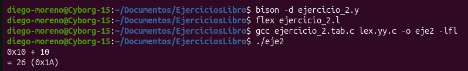
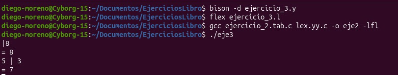
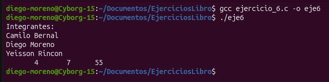

# Ejercicios del libro — Flex & Bison

Soluciones a ejercicios del capítulo sobre Flex y Bison: calculadora del libro, variantes y preguntas teóricas.

## Integrantes

- Camilo Bernal
- Diego Moreno
- Yeisson Rincón

---

## Ejercicio 1 — ¿Acepta una línea con solo un comentario?

**Pregunta del libro:** *Will the calculator accept a line that contains only a comment? Why not? Would it be easier to fix this in the scanner or in the parser?*

**Resumen:** Sin aceptación. La regla de comentarios (`"//".*`) sin consumo del salto de línea deja un `EOL` sin expresión previa y el parser falla. Corrección simple en el scanner, con consumo del `\n` (o fin de archivo) en la regla de comentario.

📄 Detalle en [`ejercicio_1.md`](ejercicio_1.md).

---

## Ejercicio 2 — Calculadora hexadecimal

**Pregunta del libro:** *Make the calculator into a hex calculator that accepts both hex and decimal numbers... use `strtol`... print the result in both decimal and hex.*

**Resumen:** Regla en `ejercicio_2.l` para hexadecimal (`0x...`) y decimal, ambas con `strtol`. Salida en `ejercicio_2.y` con `printf("= %d (0x%X)\n", ...)`, valor en decimal y hexadecimal.

**Compilación y ejecución:**

```bash
bison -d ejercicio_2.y
flex ejercicio_2.l
gcc ejercicio_2.tab.c lex.yy.c -o eje2 -lfl
./eje2
```



Ejemplo: `0x10 + 10` → `= 26 (0x1A)`.

📄 Código y explicación en [`ejercicio_2.md`](ejercicio_2.md).

---

## Ejercicio 3 — Operadores bit a bit (AND / OR)

**Pregunta del libro:** *(extra credit) Add bit operators such as AND and OR to the calculator...*

**Resumen:** Operador `&` (AND) y carácter `|` con doble uso: absoluto unario (`|numero`) y OR binario (`exp | factor`). Resolución en la gramática: token `ABS` unario al inicio de un `term`, binario entre dos `exp`. Sin conflictos en Bison por separación en niveles (`exp`, `factor`, `term`).

**Compilación y ejecución:**

```bash
bison -d ejercicio_3.y
flex ejercicio_3.l
gcc ejercicio_3.tab.c lex.yy.c -o eje3 -lfl
./eje3
```



Ejemplo: `|8` (absoluto) → `= 8`, `5 | 3` (OR) → `= 7`.

📄 Código y explicación en [`ejercicio_3.md`](ejercicio_3.md).

---

## Ejercicio 4 — Scanner manual vs Flex

**Pregunta del libro:** *Does the handwritten version of the scanner from Example 1-4 recognize exactly the same tokens as the flex version?*

**Resumen:** Sin equivalencia. La versión manual no maneja `(` y `)`, así que no produce los tokens `OP` y `CP` de la versión Flex. Para igualarlas, se agregan esos casos al `switch` con el mismo tratamiento de espacios, comentarios, `EOF` e inválidos.

📄 Detalle en [`ejercicio_4.md`](ejercicio_4.md).

---

## Ejercicio 5 — Límites de Flex

**Pregunta del libro:** *Can you think of languages for which flex wouldn't be a good tool to write a scanner?*

**Resumen:** Flex fuera de rango con tokens de contexto no regular: indentación (Python, Haskell), comentarios anidados, identificadores con valor de palabra reservada según contexto, dependencia semántica o lenguaje natural.

📄 Detalle en [`ejercicio_5.md`](ejercicio_5.md).

---

## Ejercicio 6 — Conteo en C vs Flex

**Pregunta del libro:** *Rewrite the word count program in C. Run some large files through both versions. Is the C version noticeably faster? How much harder was it to debug?*

**Resumen:** Conteo (líneas, palabras, caracteres) en C directo, con palabra = `[a-zA-Z]+`. Manejo manual de estado (dentro/fuera de palabra) frente a reglas declarativas en Flex. Mismos conteos en archivos grandes. Diferencia de velocidad reducida, versión C apenas más rápida sin la capa del scanner generado. Depuración más costosa en C.

**Compilación y ejecución:**

```bash
gcc ejercicio_6.c -o eje6
./eje6
```



📄 Código en [`ejercicio_6.c`](ejercicio_6.c).

---

## Requisitos

- `flex`
- `bison`
- `gcc`

## Compilación total

```bash
# Ejercicio 2
bison -d ejercicio_2.y
flex ejercicio_2.l
gcc ejercicio_2.tab.c lex.yy.c -o eje2 -lfl

# Ejercicio 3
bison -d ejercicio_3.y
flex ejercicio_3.l
gcc ejercicio_3.tab.c lex.yy.c -o eje3 -lfl

# Ejercicio 6
gcc ejercicio_6.c -o eje6
```
