# Calculadora científica graficadora con ANTLR (Visitor)

Actividad del curso **Lenguajes de Programación y Traducción**. Tema: ANTLR 4, árboles sintácticos y patrón Visitor.

## Integrantes

- Camilo Bernal
- Diego Moreno
- Yeisson Rincón

## Descripción general

DSL en **ANTLR 4** para cálculo matemático. Base aritmética simple (suma, resta, multiplicación, división) con extensión hasta calculadora científica:

- Expresiones con precedencia correcta.
- Variables con tabla de símbolos.
- Potencia, unarios y funciones (`sin`, `cos`, `tan`, `sqrt`, `log`, `ln`, `abs`, `exp`, `asin`, `acos`, `atan`, `floor`, `ceil`).
- Funciones de dos argumentos (`pow`, `max`, `min`).
- Constantes (`pi`, `e`).
- Comandos (`clear`, `vars`).
- Gráfica en Swing, rango vertical opcional y varias funciones por ventana.
- Funciones de usuario (`f(x) = x^2 + 2*x + 1`), uso directo y en `plot`.

Flujo general:

```
Texto -> Lexer -> Tokens -> Parser -> Árbol -> Visitor -> Resultado
```

- **Lexer**: texto a tokens (números, identificadores, operadores, palabras clave).
- **Parser**: tokens a árbol según la gramática.
- **Visitor**: recorrido del árbol y evaluación.

Gramática = sintaxis (combinaciones válidas). Visitor = semántica (significado de cada combinación).

## Entorno

- Java OpenJDK 21 (JDK, por `javac`)
- ANTLR 4.13.2 (`antlr-4.13.2-complete.jar` en `$CLASSPATH`)
- Linux (Ubuntu)

## Estructura

```
ScientificCalculator/
├── README.md
├── .gitignore
├── capturas/
│   ├── pasoN.png
│   └── retoN.png
├── ScientificCalc.g4
├── Main.java
├── ScientificEvalVisitor.java
├── PlotWindow.java
└── ejemplos.txt
```

Archivos generados desde `ScientificCalc.g4` (`ScientificCalcLexer.java`, `ScientificCalcParser.java`, `ScientificCalcVisitor.java`, `ScientificCalcBaseVisitor.java`, `*.tokens`/`*.interp`) fuera del repositorio. Solo el código fuente está en versionado. La lista completa está en `.gitignore`.

## Descarga y ejecución

### 1. Requisitos previos

- JDK 11 o superior (`javac -version`)
- ANTLR 4 como comando `antlr4` (`antlr4` sin error). Guía: https://github.com/antlr/antlr4/blob/master/doc/getting-started.md

### 2. Clonación

```bash
git clone https://github.com/DiegoWtt26/LenguajesDeProgramacionYtransduccion.git
```

### 3. Carpeta de la actividad

```bash
cd LenguajesDeProgramacionYtransduccion/ScientificCalculator
```

### 4. Generación de lexer/parser/visitor

Obligatorio en clonación inicial:

```bash
antlr4 -no-listener -visitor ScientificCalc.g4
```

Salida: `ScientificCalcLexer.java`, `ScientificCalcParser.java`, `ScientificCalcVisitor.java`, `ScientificCalcBaseVisitor.java`.

### 5. Compilación

```bash
javac *.java
```

Compilación de generados + manuales (`Main.java`, `ScientificEvalVisitor.java`, `PlotWindow.java`).

### 6. Ejecución

```bash
java Main
```

Lectura por consola, línea por línea. Ejemplo:

```
radio = 10
area = pi * radio^2
area
sin(pi/2)
plot(sin(x), -6.28, 6.28)
```

Cierre con `Ctrl+D` (Linux/Mac) o `Ctrl+Z` + Enter (Windows).

### Alternativa con archivo de ejemplos

```bash
java Main < ejemplos.txt
```

Recorrido completo de funciones del lenguaje, retos incluidos.

---

## Recorrido del laboratorio

Orden de desarrollo. Marca **práctica** (código + terminal, con captura) o **análisis** (concepto, sin ejecución).

### Sección 3 — Calculadora del libro (análisis)

Regla de expresiones del ejemplo clásico:

```antlr
expr
    : expr op=('*'|'/') expr # MulDiv
    | expr op=('+'|'-') expr # AddSub
    | INT                    # int
    | ID                     # id
    | '(' expr ')'           # parens
    ;
```

**Pregunta:** método separado por operación frente a método único.

**Respuesta:** método único (`visitExpr`) con cadena `if`/`else` para tipo de nodo. Con etiquetas (`# MulDiv`, `# AddSub`...) cada alternativa genera nodo Java distinto y método `visit` propio (`visitMulDiv`, `visitAddSub`...). Despacho automático por tipo, sin condicionales. Contexto tipado por método (`AddSubContext` con `.op`, `.expr(0)`, `.expr(1)`).

### Sección 4 — Creación del proyecto (práctica)

Carpeta `ScientificCalculator/` con base mínima:

```bash
mkdir ScientificCalculator
cd ScientificCalculator
touch ScientificCalc.g4 Main.java ScientificEvalVisitor.java PlotWindow.java ejemplos.txt
```

Generados ANTLR en pasos posteriores, sin escritura manual.

### Sección 5 — Primera gramática (práctica)

Versión inicial de `ScientificCalc.g4`, reglas `prog`, `stat`, `expr`:

```antlr
grammar ScientificCalc;

prog
    : stat+ EOF
    ;

stat
    : expr NEWLINE               # printExpr
    | ID '=' expr NEWLINE        # assign
    | NEWLINE                    # blank
    ;

expr
    : expr op=('*'|'/') expr     # mulDiv
    | expr op=('+'|'-') expr     # addSub
    | NUMBER                     # number
    | ID                         # id
    | '(' expr ')'               # parens
    ;

MUL : '*';
DIV : '/';
ADD : '+';
SUB : '-';

NUMBER : [0-9]+ ('.' [0-9]+)? ;
ID     : [a-zA-Z_][a-zA-Z_0-9]* ;
NEWLINE: '\r'? '\n' ;
WS     : [ \t]+ -> skip ;
```

Orden en `expr` = precedencia. ANTLR con recursión izquierda da mayor precedencia a la alternativa inicial. `mulDiv` antes de `addSub`: multiplicación/división antes de suma/resta.

### Sección 6 — Alcance de la gramática (práctica)

Análisis previo de `NUMBER` e `ID`.

`NUMBER: [0-9]+ ('.' [0-9]+)?` → dígitos con decimal opcional (`10`, `3.14`).

`ID: [a-zA-Z_][a-zA-Z_0-9]*` → inicio letra o `_`, resto letras/dígitos/`_`.

Prueba con `grun`:

```bash
antlr4 -no-listener -visitor ScientificCalc.g4
echo "variable" | grun ScientificCalc prog -tokens
```

| Entrada | Tokens | ¿ID único? | Motivo |
|---|---|---|---|
| `variable` | `ID("variable")` | Sí | Regla completa |
| `x2` | `ID("x2")` | Sí | Dígito en posición no inicial |
| `2x` | `NUMBER("2")` + `ID("x")` | No | Inicio con dígito, fuera de `ID` |
| `_resultado` | `ID("_resultado")` | Sí | `_` inicial válido |
| `variable-final` | `ID("variable")` + `SUB('-')` + `ID("final")` | No | `-` como resta, corte del identificador |

Primer carácter de `ID` restringido a letra/`_`; resto con dígitos. `-` reservado como resta, sin pertenencia a identificadores.

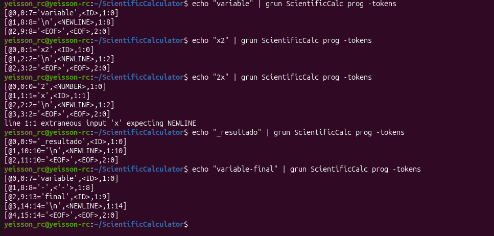

### Sección 7 — Generación del Visitor (práctica + análisis)

```bash
antlr4 -no-listener -visitor ScientificCalc.g4
```

Salida:

- `ScientificCalcLexer.java` — análisis léxico.
- `ScientificCalcParser.java` — análisis sintáctico.
- `ScientificCalcVisitor.java` — interfaz con `visit...` por etiqueta.
- `ScientificCalcBaseVisitor.java` — base sin lógica, visita a hijos. Clase para extensión con semántica.

`grep "visit" ScientificCalcVisitor.java` con `visitPrintExpr`, `visitAssign`, `visitBlank`, `visitMulDiv`, `visitAddSub`, `visitNumber`, `visitId`, `visitParens` (+ `visitProg`). Correspondencia etiqueta → método.

### Sección 8 — Visitor propio (práctica)

`ScientificEvalVisitor.java`, extensión de la base generada:

```java
import java.util.HashMap;
import java.util.Map;

public class ScientificEvalVisitor
        extends ScientificCalcBaseVisitor<Double> {

    Map<String, Double> memory = new HashMap<>();
}
```

`<Double>` = evaluación a número real. Diferencia con el ejemplo del libro (`Integer`): soporte de decimales, raíces, logaritmos y trigonometría sin conversiones. `memory` = tabla de símbolos, único estado entre líneas. Árbol por línea de uso temporal.

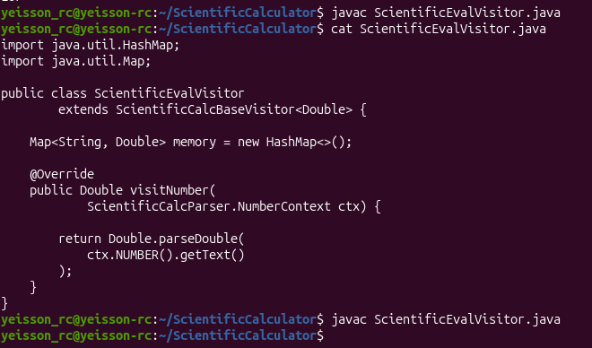

### Sección 9 — Números (práctica)

```java
@Override
public Double visitNumber(
        ScientificCalcParser.NumberContext ctx) {

    return Double.parseDouble(
        ctx.NUMBER().getText()
    );
}
```

Texto del token con `.getText()`, conversión con `Double.parseDouble`. Caso base de la recursión.

### Sección 10 — Suma y resta (práctica)

```java
@Override
public Double visitAddSub(
        ScientificCalcParser.AddSubContext ctx) {

    double left = visit(ctx.expr(0));
    double right = visit(ctx.expr(1));

    if (ctx.op.getType() == ScientificCalcParser.ADD) {
        return left + right;
    }

    return left - right;
}
```

`visit(ctx.expr(0))` = llamada recursiva al subárbol, sin importar el tipo (otro `AddSub`, `MulDiv`, número, variable...). Evaluación de anidación arbitraria (`2 + 3 * (4 - 1)`) sin tamaño prefijado. `ctx.op` desde `op=('+'|'-')`, comparación con constantes (`ADD`, `SUB`).

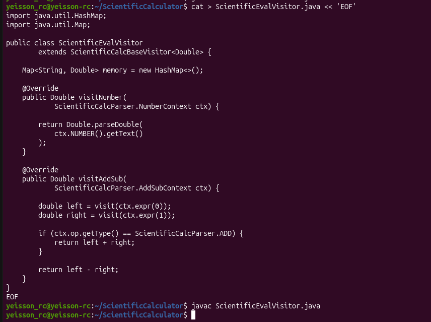

`visitMulDiv` con mismo patrón, comparación con `MUL`/`DIV`:

```java
@Override
public Double visitMulDiv(
        ScientificCalcParser.MulDivContext ctx) {

    double left = visit(ctx.expr(0));
    double right = visit(ctx.expr(1));

    if (ctx.op.getType() == ScientificCalcParser.MUL) {
        return left * right;
    }

    return left / right;
}
```

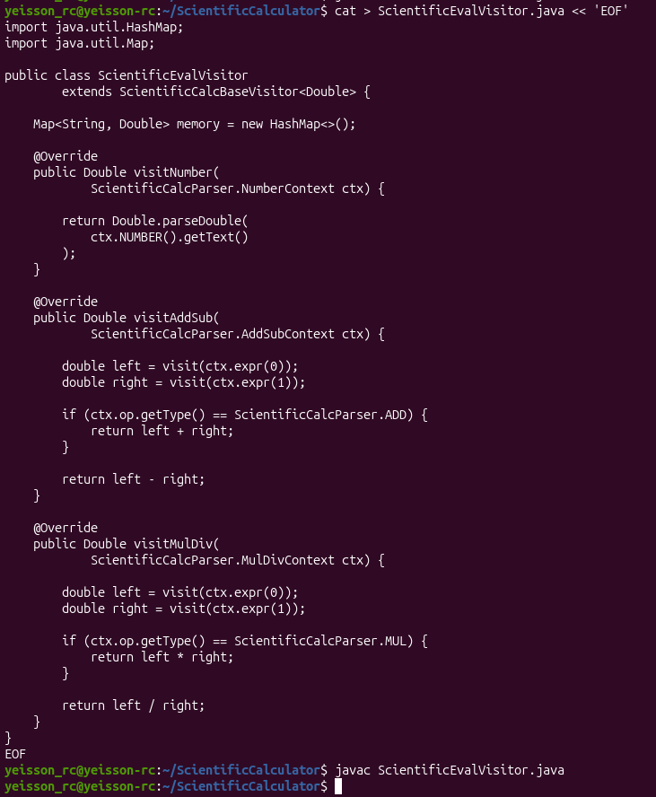

### Sección 11 — Paréntesis (práctica)

```java
@Override
public Double visitParens(
        ScientificCalcParser.ParensContext ctx) {

    return visit(ctx.expr());
}
```

Delegación sin operación. Cambio en forma del árbol y orden de evaluación. `2 + 3 * 4` frente a `(2 + 3) * 4`: `14` vs `20`, mismos símbolos, distinto árbol.

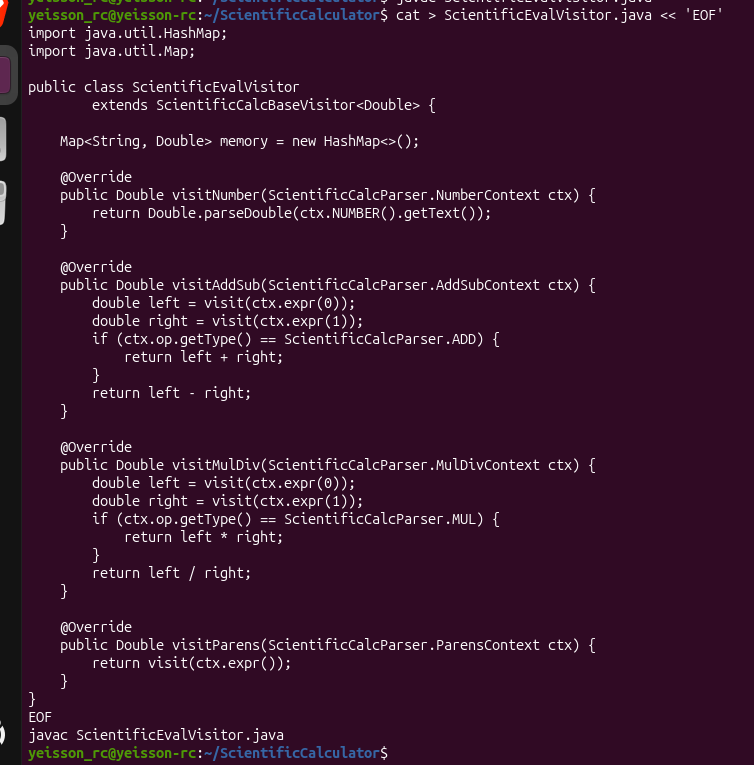

### Sección 12 — Programa principal (práctica)

`Main.java`, pipeline lexer → parser → visitor:

```java
import org.antlr.v4.runtime.*;
import org.antlr.v4.runtime.tree.*;

public class Main {

    public static void main(String[] args) throws Exception {

        CharStream input = CharStreams.fromStream(System.in);

        ScientificCalcLexer lexer = new ScientificCalcLexer(input);
        CommonTokenStream tokens = new CommonTokenStream(lexer);
        ScientificCalcParser parser = new ScientificCalcParser(tokens);

        ParseTree tree = parser.prog();

        ScientificEvalVisitor visitor = new ScientificEvalVisitor();
        visitor.visit(tree);
    }
}
```

`CharStreams.fromStream(System.in)` = caracteres de entrada. `Lexer` = tokens. `CommonTokenStream` = buffer de consumo. `parser.prog()` = regla raíz y árbol. `visitor.visit(tree)` = recorrido y disparo de métodos `visit...`.

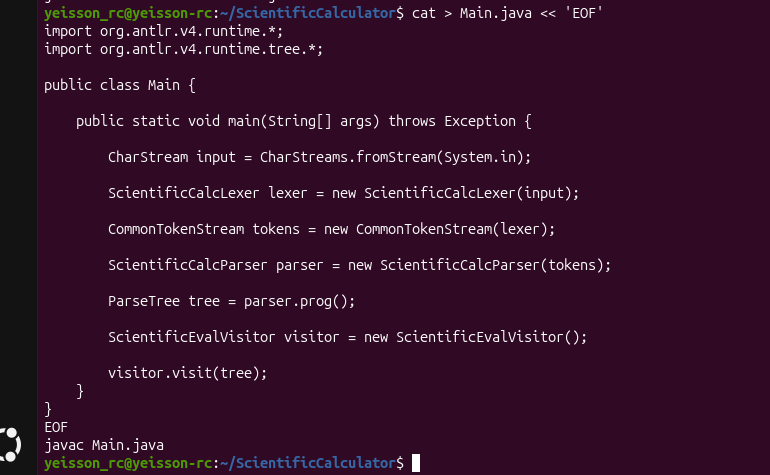

### Sección 13 — Salida de resultados (práctica)

```java
@Override
public Double visitPrintExpr(
        ScientificCalcParser.PrintExprContext ctx) {

    double value = visit(ctx.expr());
    System.out.println(value);
    return value;
}
```

Disparo en línea con solo expresión (sin asignación).

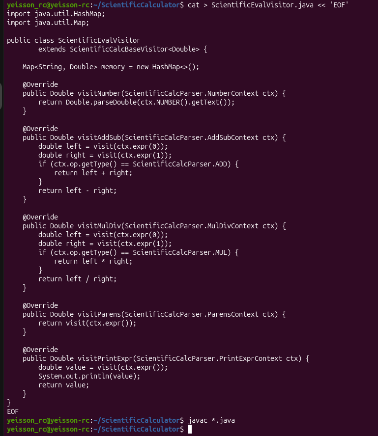

### Sección 14 — Primera prueba (práctica)

Compilación y ejecución con base aritmética:

```bash
javac *.java
java Main
```

| Expresión | Resultado |
|---|---|
| `2+2` | `4.0` |
| `10-3` | `7.0` |
| `10*5` | `50.0` |
| `20/4` | `5.0` |
| `2+3*4` | `14.0` |
| `(2+3)*4` | `20.0` |

`2+3*4 = 14.0` como validación de precedencia.

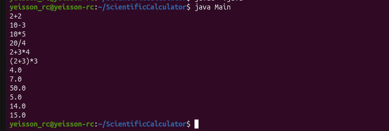

### Sección 15 — Variables (práctica)

`visitAssign` (escritura) y `visitId` (lectura):

```java
@Override
public Double visitAssign(
        ScientificCalcParser.AssignContext ctx) {

    String id = ctx.ID().getText();
    double value = visit(ctx.expr());
    memory.put(id, value);
    return value;
}

@Override
public Double visitId(
        ScientificCalcParser.IdContext ctx) {

    String id = ctx.ID().getText();
    if (memory.containsKey(id)) {
        return memory.get(id);
    }
    System.err.println("Variable no definida: " + id);
    return 0.0;
}
```

`visitAssign`: evaluación derecha de `=` + guardado en `memory`. `visitId`: búsqueda en `memory` por nombre.

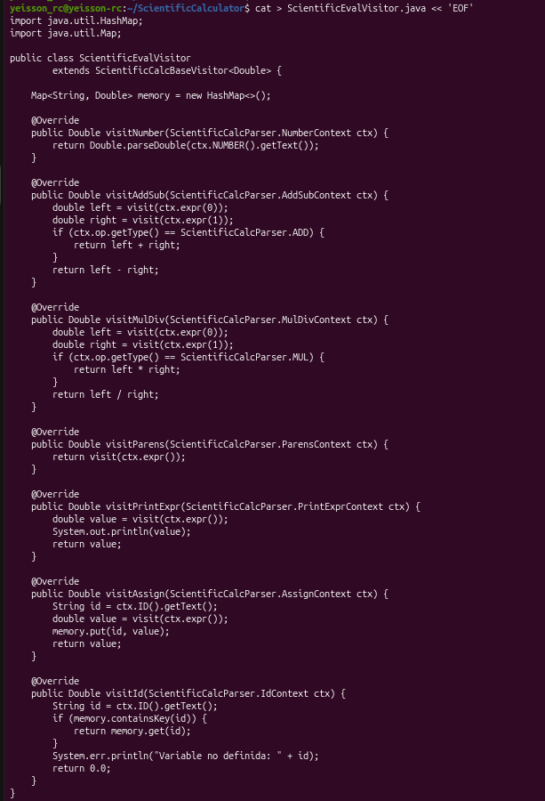

### Sección 16 — Comprobación de variables (práctica + análisis)

Prueba:

```
a = 10
b = 20
a+b
a*b
```

Resultado `30.0` y `200.0`. Persistencia entre líneas.

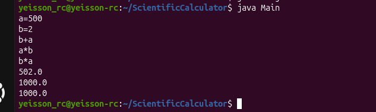

Caso variable sin asignación (`resultado + 10`): aviso en `System.err` sin detención, retorno `0.0` y resultado `10.0`. Diseño tolerante frente a alternativa estricta (excepción + detención). Tolerancia con riesgo de error silencioso por nombre mal escrito.

### Sección 17 — Potencia (práctica)

Extensión con operador `^`:

```antlr
expr
    : <assoc=right> expr '^' expr   # power
    | expr op=('*'|'/') expr        # mulDiv
    | expr op=('+'|'-') expr        # addSub
    | NUMBER                        # number
    | ID                            # id
    | '(' expr ')'                  # parens
    ;
```

Posición inicial = mayor precedencia (`2*3^2` como `2*9=18`). `<assoc=right>` = asociatividad derecha. `2^3^2` como `2^(3^2) = 512`, convención matemática.

Implementación:

```java
@Override
public Double visitPower(
        ScientificCalcParser.PowerContext ctx) {

    double base = visit(ctx.expr(0));
    double exponent = visit(ctx.expr(1));

    return Math.pow(base, exponent);
}
```

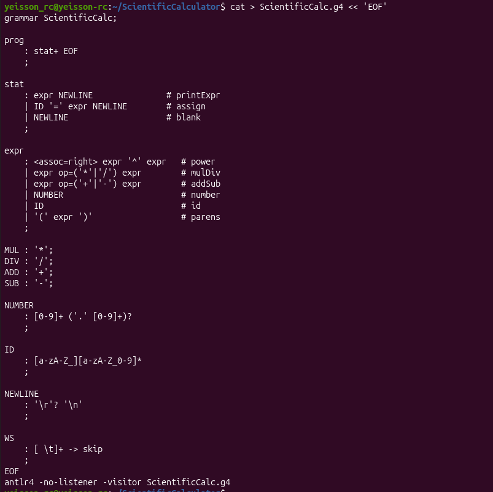
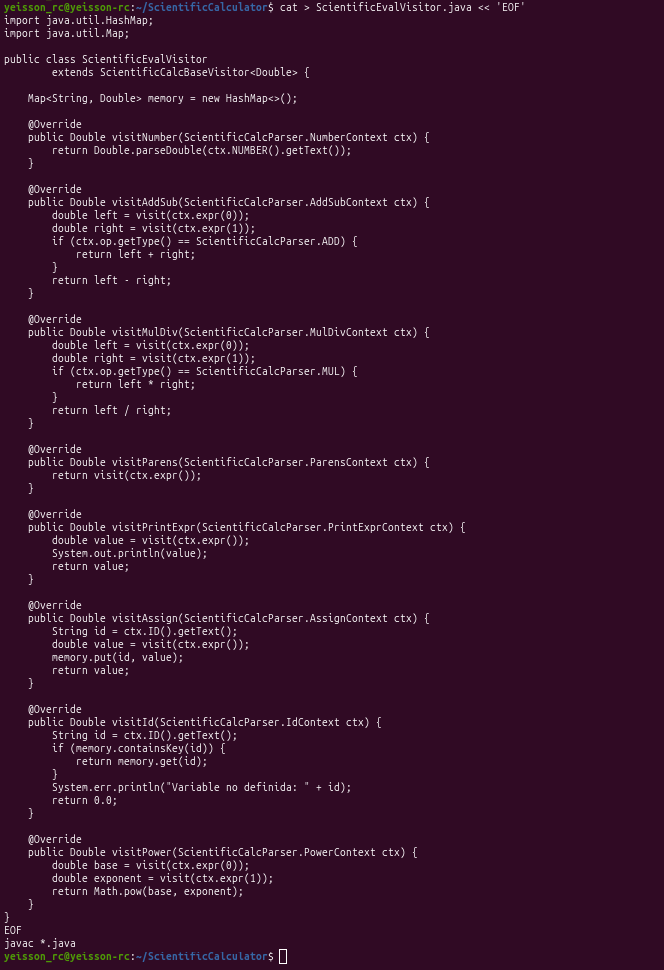

### Sección 18 — Comprobación de potencia (práctica)

Cálculo manual previo:

| Expresión | Cálculo | Esperado |
|---|---|---|
| `2^8` | 2 a la 8 | `256.0` |
| `10^2` | 10 a la 2 | `100.0` |
| `2^3+4` | 8+4 | `12.0` |
| `2*3^2` | 2*9 | `18.0` |

Coincidencia en intérprete. Precedencia validada.

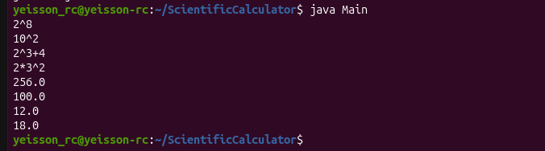

### Sección 19-20 — Funciones matemáticas (práctica)

Regla `function` + alternativa `functionCall`:

```antlr
expr
    : <assoc=right> expr '^' expr   # power
    | expr op=('*'|'/') expr        # mulDiv
    | expr op=('+'|'-') expr        # addSub
    | function '(' expr ')'         # functionCall
    | NUMBER                        # number
    | ID                            # id
    | '(' expr ')'                  # parens
    ;

function
    : 'sin' | 'cos' | 'tan' | 'sqrt' | 'log' | 'ln' | 'abs' | 'exp'
    ;
```

Implementación con nombre de función como texto, argumento evaluado y `switch` a `Math`:

```java
@Override
public Double visitFunctionCall(
        ScientificCalcParser.FunctionCallContext ctx) {

    String function = ctx.function().getText();
    double value = visit(ctx.expr());

    switch (function) {
        case "sin":  return Math.sin(value);
        case "cos":  return Math.cos(value);
        case "tan":  return Math.tan(value);
        case "sqrt": return Math.sqrt(value);
        case "log":  return Math.log10(value);
        case "ln":   return Math.log(value);
        case "abs":  return Math.abs(value);
        case "exp":  return Math.exp(value);
        default:
            throw new RuntimeException("Funcion desconocida: " + function);
    }
}
```

`log` = base 10 (`Math.log10`), `ln` = base *e* (`Math.log`). Funciones separadas.

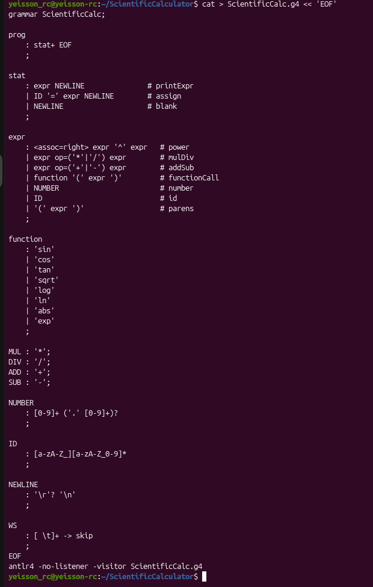
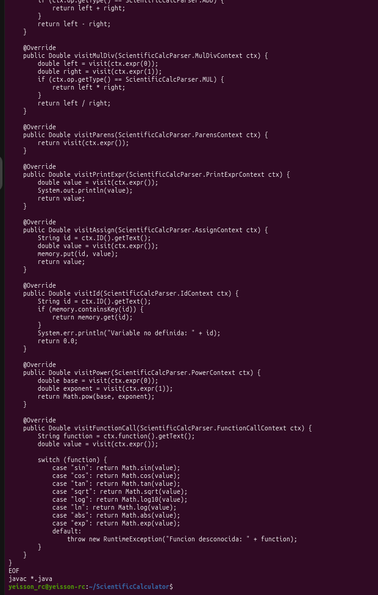

### Sección 21 — Prueba de funciones (práctica)

`sqrt(25)`, `cos(0)`, `log(100)` con salida correcta. `abs(-10)` sin parseo: falta de signo unario en la gramática (solo resta binaria). Corrección en la sección siguiente.

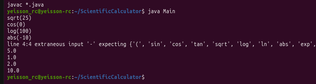

### Sección 22 — Operadores unarios (práctica)

Alternativa en `expr`:

```antlr
| op=('+'|'-') expr             # unary
```

Implementación:

```java
@Override
public Double visitUnary(
        ScientificCalcParser.UnaryContext ctx) {

    double value = visit(ctx.expr());

    if (ctx.op.getText().equals("-")) {
        return -value;
    }
    return value;
}
```

Soporte de `-10`, `abs(-10)`, `-2+5`. `-` inicial como negación, no como resta.

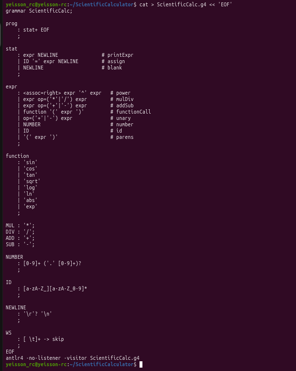
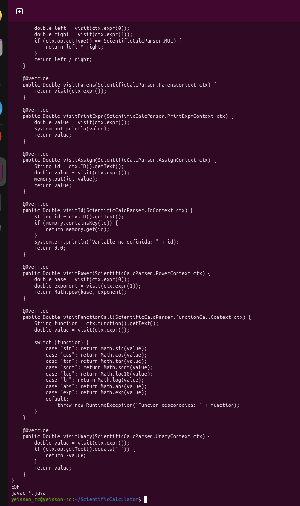
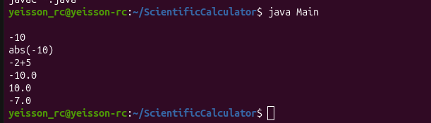

### Sección 23 — Constantes matemáticas (práctica)

Regla `constant` + `constantExpr`:

```antlr
| constant                      # constantExpr

constant
    : 'pi' | 'e'
    ;
```

Implementación:

```java
@Override
public Double visitConstantExpr(
        ScientificCalcParser.ConstantExprContext ctx) {

    String constant = ctx.constant().getText();

    if (constant.equals("pi")) {
        return Math.PI;
    }
    if (constant.equals("e")) {
        return Math.E;
    }
    return 0.0;
}
```

Valor fijo, sin definición previa. Diferencia con variables en `memory` (sobrescritura posible).

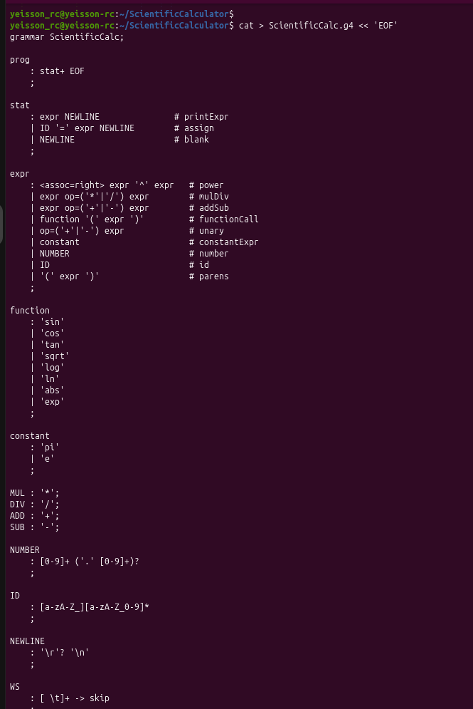
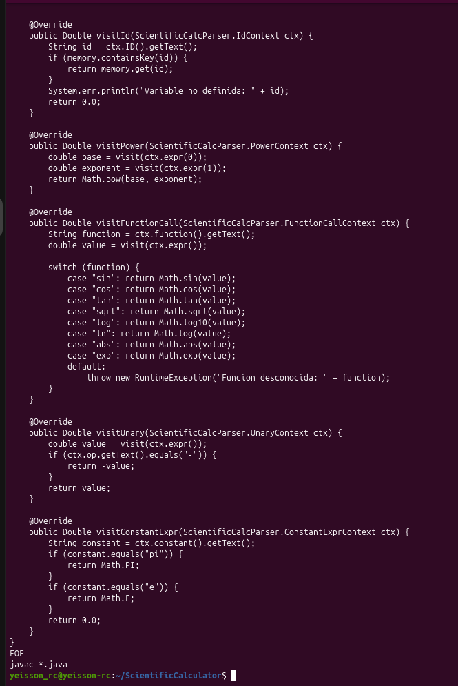

### Sección 24 — Calculadora científica base (práctica)

Prueba integral:

| Expresión | Resultado aprox. |
|---|---|
| `sin(pi/2)` | `1.0` |
| `cos(0)` | `1.0` |
| `log(100)` | `2.0` |
| `ln(e)` | `1.0` |
| `sqrt(25)` | `5.0` |
| `2^8` | `256.0` |

Coincidencia total. Núcleo científico funcional.

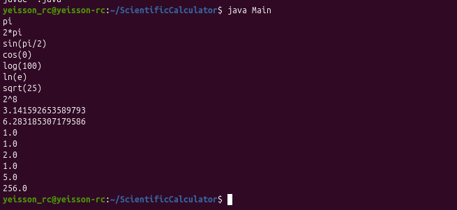

### Sección 25 — Comando `clear` (práctica)

Instrucción en `stat` (no expresión):

```antlr
| 'clear' NEWLINE            # clear
```

```java
@Override
public Double visitClear(
        ScientificCalcParser.ClearContext ctx) {

    memory.clear();
    System.out.println("Memoria eliminada.");
    return 0.0;
}
```

Vaciado de tabla de símbolos. Comando imperativo sobre estado del intérprete.

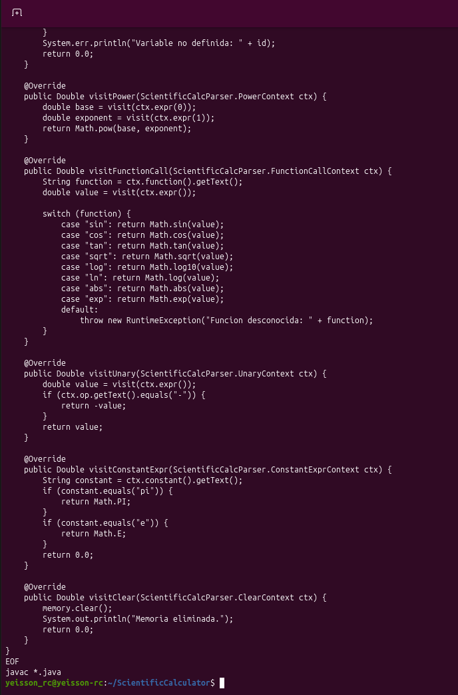
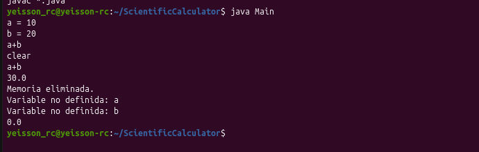

### Sección 26 — Comando `vars` (práctica)

```antlr
| 'vars' NEWLINE             # showVars
```

```java
@Override
public Double visitShowVars(
        ScientificCalcParser.ShowVarsContext ctx) {

    if (memory.isEmpty()) {
        System.out.println("No hay variables definidas.");
        return 0.0;
    }

    for (Map.Entry<String, Double> entry : memory.entrySet()) {
        System.out.println(entry.getKey() + " = " + entry.getValue());
    }
    return 0.0;
}
```

Listado de variables actuales.

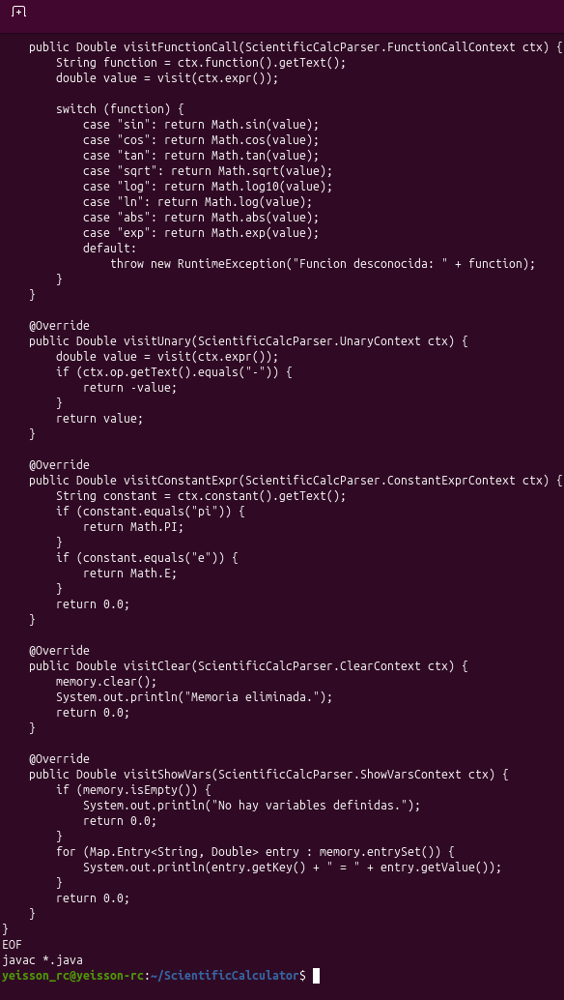
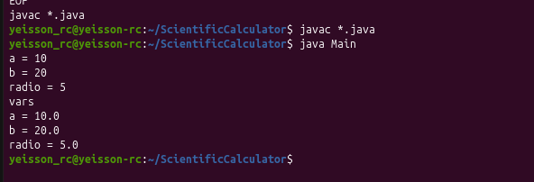

### Sección 27-30 — Diseño de graficación (análisis)

Evaluación simple = una vez por expresión (`sin(pi/2)` → un número). Gráfica `y = sin(x)` = misma expresión con muchos valores de `x`:

| x | sin(x) |
|---|---|
| -2 | -0.909 |
| -1 | -0.841 |
| 0 | 0 |
| 1 | 0.841 |
| 2 | 0.909 |

Estrategia: asignación de `x` en tabla, visita repetida del mismo árbol, obtención de `y`, cambio de `x`. Árbol estático, estado externo (`memory`) variable. Consulta de nodo `id` en cada pasada.

Sintaxis: `plot(expresion, xmin, xmax)`, ejemplo `plot(sin(x), -6.28, 6.28`:

```antlr
| 'plot' '(' expr ',' expr ',' expr ')' NEWLINE  # plotExpr
```

`ctx.expr(0)` = función, `ctx.expr(1)` = `xmin`, `ctx.expr(2)` = `xmax`.

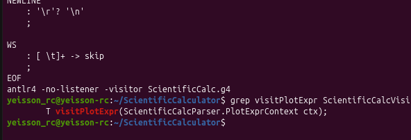

### Sección 31 — `visitPlotExpr` (práctica)

Muestreo en 800 puntos entre `xmin` y `xmax`, reasignación de `x` y reevaluación:

```java
@Override
public Double visitPlotExpr(
        ScientificCalcParser.PlotExprContext ctx) {

    double xmin = visit(ctx.expr(1));
    double xmax = visit(ctx.expr(2));

    int samples = 800;

    List<Double> xs = new ArrayList<>();
    List<Double> ys = new ArrayList<>();

    for (int i = 0; i < samples; i++) {
        double x = xmin + i * (xmax - xmin) / (samples - 1);
        memory.put("x", x);
        double y = visit(ctx.expr(0));

        if (Double.isFinite(y)) {
            xs.add(x);
            ys.add(y);
        }
    }

    new PlotWindow(xs, ys);
    return 0.0;
}
```

*(Versión inicial, reemplazo en retos 3 y 4.)*

### Sección 32 — Discontinuidades (análisis)

`plot(1/x, -5, 5)` con `Infinity`, `-Infinity`, `NaN` en `x = 0`. División `double` entre cero sin excepción, con valores especiales. Filtro con `Double.isFinite(y)` en el bucle. Punto no finito fuera de `xs`/`ys`. Corte de curva en asíntota vertical, sin línea infinita.

### Sección 33 — Ventana gráfica (práctica)

`PlotWindow.java`, extensión de `JPanel` en `JFrame`:

```java
public class PlotWindow extends JPanel {

    private List<Double> xs;
    private List<Double> ys;

    public PlotWindow(List<Double> xs, List<Double> ys) {
        this.xs = xs;
        this.ys = ys;

        JFrame frame = new JFrame("Scientific Calculator");
        frame.setDefaultCloseOperation(JFrame.DISPOSE_ON_CLOSE);
        frame.setSize(800, 600);
        frame.add(this);
        frame.setVisible(true);
    }
}
```

Apertura de ventana 800x600. Dibujo posterior en `paintComponent`. Ampliación en retos 3 y 4.

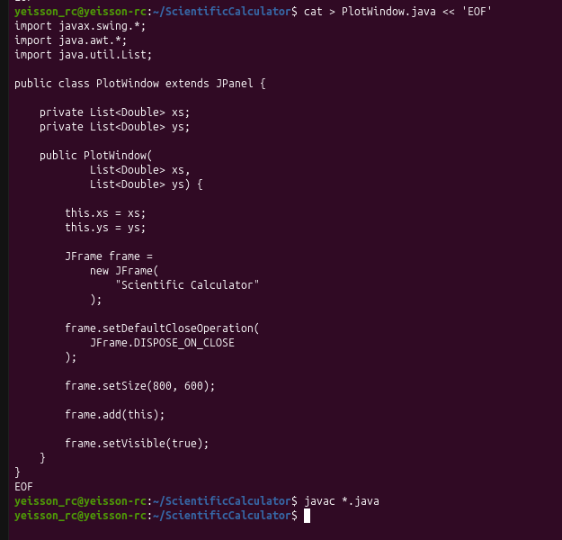

### Sección 34-36 — Límites, coordenadas y dibujo (práctica)

Implementación conjunta en `paintComponent` (invocación automática de Swing).

Límites verticales desde muestreo (`xmin`/`xmax` desde `plot`):

```java
double ymin = ys.stream().mapToDouble(Double::doubleValue).min().orElse(-1);
double ymax = ys.stream().mapToDouble(Double::doubleValue).max().orElse(1);
```

Transformación matemático → píxel:

```java
int px = (int)((x - xmin) / (xmax - xmin) * getWidth());
int py = getHeight() - (int)((y - ymin) / (ymax - ymin) * getHeight());
```

Resta en `py` por eje Y invertido en Java (origen arriba-izquierda). Sin inversión, gráfica volteada.

Trazado con segmentos entre puntos consecutivos (`g2.drawLine(...)`), curva continua.

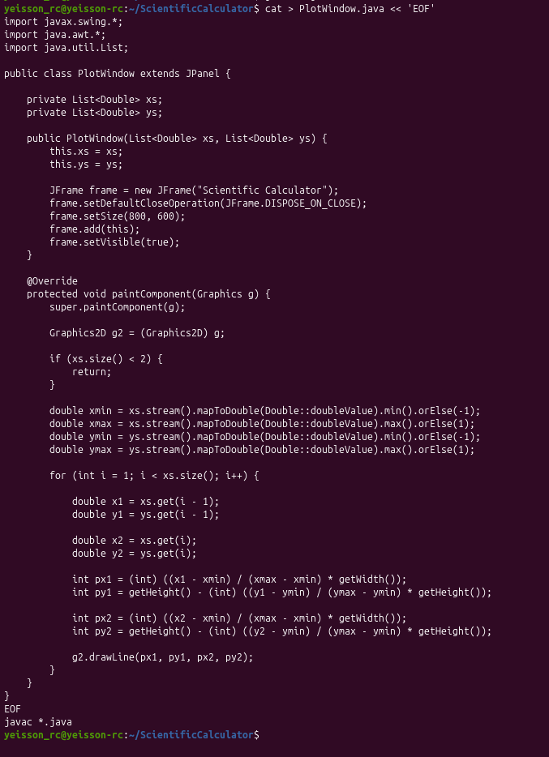

### Sección 37 — Primera gráfica (práctica)

Ejecución:

```
plot(x^2,-10,10)
```

Parábola correcta. Prueba adicional:

```
plot(sin(x),-6.28,6.28)
```

Curva de seno en rango ~2π.

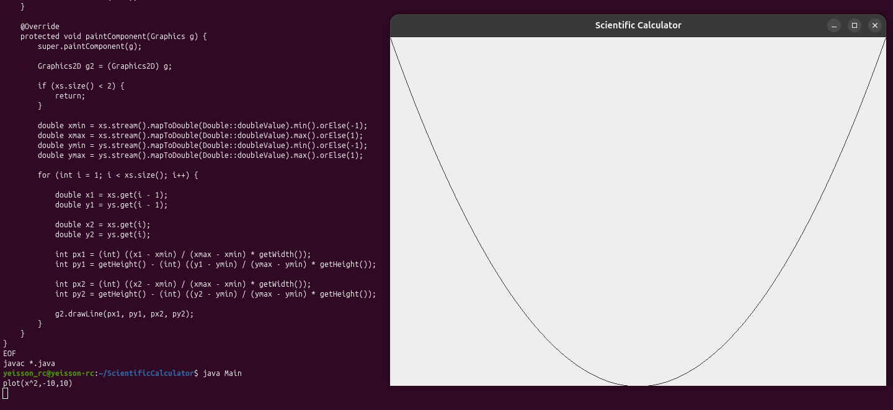
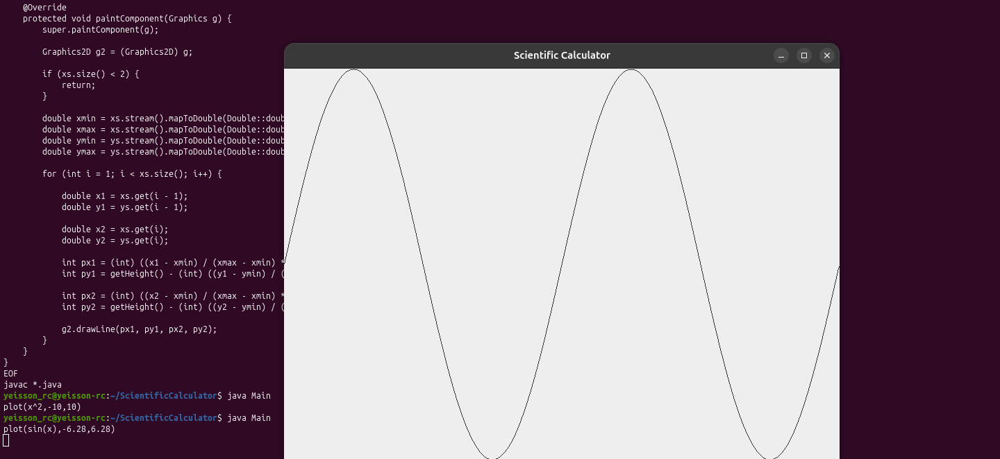

### Sección 38 — Archivo de pruebas (práctica)

`ejemplos.txt` con aritmética, variables, funciones, constantes, `vars`, `plot`. Ejecución por redirección:

```bash
java Main < ejemplos.txt
```

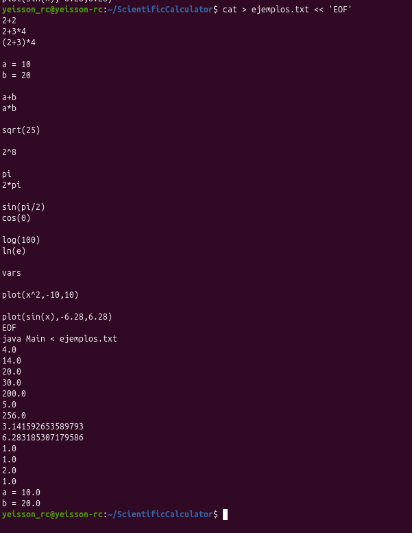

### Sección 39 — Árbol sintáctico (análisis)

Expresión `sin(x) + 2*x^2`:

- Suma: raíz `addSub`, combinación de `sin(x)` y `2*x^2`.
- Seno: nodo `functionCall`, función `sin`, argumento `x`.
- Multiplicación: nodo `mulDiv` entre `2` y `x^2`.
- Potencia: nodo `power` entre `x` y `2`.
- `x`: dos nodos `id` distintos, misma variable.
- `2`: nodo `number`.

`visit(ctx.expr())` = recorrido de árbol, no evaluación de texto. Texto convertido a objetos (`AddSubContext`, `FunctionCallContext`...) antes del Visitor. Sin relectura del string original.

### Sección 40 — Prueba integral (práctica)

```
radio = 10
area = pi * radio^2
area
angulo = pi/4
sin(angulo)
cos(angulo)
vars
plot(sin(x), -6.28, 6.28)
plot(x^2, -10, 10)
```

Ejecución correcta. Integración de variables, anidación, trigonometría, `vars` y dos gráficas.

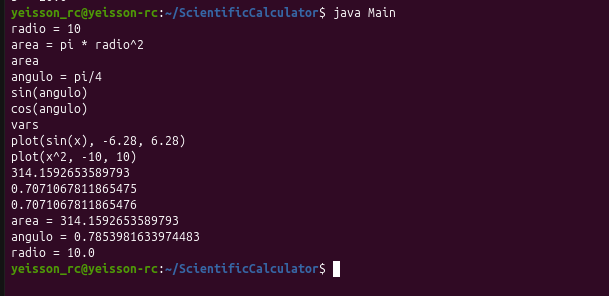

### Sección 41 — Preguntas finales (análisis)

1. **¿Lexer?** Texto a tokens (números, identificadores, operadores, palabras clave). Descarte de espacios.
2. **¿Parser?** Tokens a árbol según reglas. Error ante secuencia inválida.
3. **¿Etiquetas `#addSub`, `#functionCall`?** Nodo Java distinto por alternativa, método `visit` propio. Sin distinción manual de tipos.
4. **¿Ventaja Visitor?** Separación sintaxis (gramática) / semántica (visitor). Extensión de significado sin cambio de gramática, y viceversa.
5. **¿Tabla de símbolos?** Mapa `memory`, nombre → valor. Estado persistente entre líneas.
6. **¿Cambio de `x` en gráfica?** Curva `y = f(x)` con múltiples puntos. Reasignación en `memory` por cada evaluación.
7. **¿Reevaluación del mismo árbol?** Árbol estático, construcción única. Cambio solo en estado externo (`memory`).
8. **¿Discontinuidad en gráfica?** Valor no finito (`Infinity`, `NaN`) en el punto. Filtro con `Double.isFinite(y)`, omisión del punto.
9. **¿Funciones con dos argumentos?** Regla con lista separada por comas. Implementación en reto 2.
10. **¿DSL?** Lenguaje acotado a cálculo y gráficas. Diseño específico frente a propósito general (Java, Python).

### Sección 43 — Lista de comprobación (análisis)

- [x] Números reales
- [x] Suma
- [x] Resta
- [x] Multiplicación
- [x] División
- [x] Paréntesis
- [x] Variables
- [x] Potencia
- [x] Operadores unarios
- [x] Constantes `pi` y `e`
- [x] Funciones científicas
- [x] Comando `clear`
- [x] Comando `vars`
- [x] Comando `plot`
- [x] Visualización gráfica

Ítems con verificación en terminal (capturas por sección).

### Sección 44 — Reflexión final (análisis)

Gramática inicial mínima (suma/resta) con crecimiento hasta lenguaje matemático (variables, funciones, graficación). Arquitectura constante:

```
Gramática -> Lexer -> Parser -> Árbol -> Visitor
```

Gramática = sintaxis (escritura válida). Visitor = semántica (significado). Extensión por piezas (potencias, funciones, constantes, comandos, graficación, 5 retos) sin reescritura por paso. Misma base de intérpretes, compiladores, traductores, análisis estático y consultas. Calculadora como ejemplo funcional de DSL matemático con ANTLR y Visitor.

---

## Retos opcionales

5 retos de extensión. Desarrollo en orden de la guía.

### Reto 1 — Nuevas funciones (`asin`, `acos`, `atan`, `floor`, `ceil`)

Ampliación de `function`, sin cambio en `expr` (mismo patrón unario):

```antlr
function
    : 'sin'
    | 'cos'
    | 'tan'
    | 'sqrt'
    | 'log'
    | 'ln'
    | 'abs'
    | 'exp'
    | 'asin'
    | 'acos'
    | 'atan'
    | 'floor'
    | 'ceil'
    ;
```

Casos en `visitFunctionCall`:

```java
case "asin":  return Math.asin(value);
case "acos":  return Math.acos(value);
case "atan":  return Math.atan(value);
case "floor": return Math.floor(value);
case "ceil":  return Math.ceil(value);
```

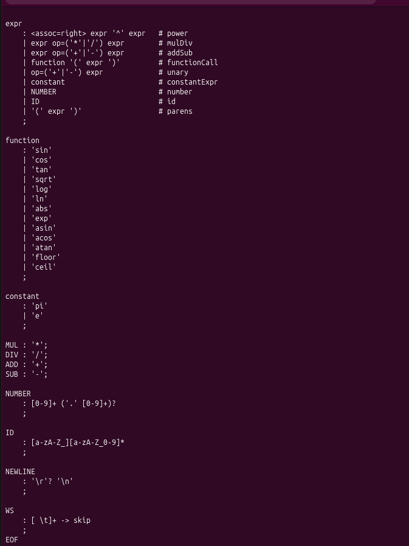
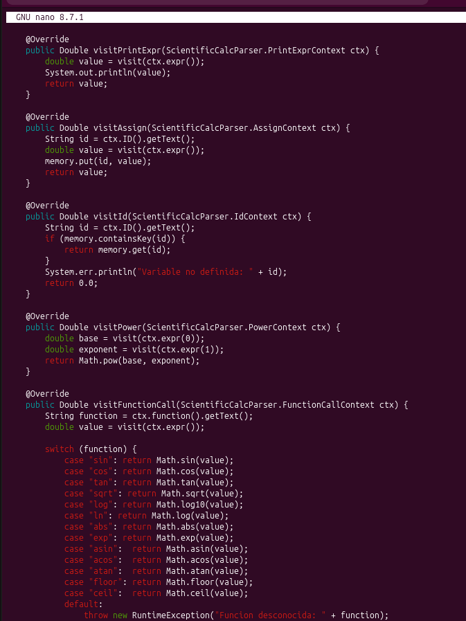
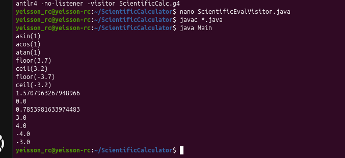

Prueba:
```
asin(1)
acos(1)
atan(1)
floor(3.7)
ceil(3.2)
```
Resultados: `≈ 1.5708` (π/2), `0.0`, `≈ 0.7854` (π/4), `3.0`, `4.0`.

### Reto 2 — Funciones con dos argumentos (`pow`, `max`, `min`)

Separación uno/dos argumentos para evitar ambigüedad con la coma. Regla `function2` + alternativa `functionCall2`:

```antlr
expr
    : <assoc=right> expr '^' expr        # power
    | expr op=('*'|'/') expr             # mulDiv
    | expr op=('+'|'-') expr             # addSub
    | function2 '(' expr ',' expr ')'    # functionCall2
    | function '(' expr ')'              # functionCall
    | op=('+'|'-') expr                  # unary
    | constant                           # constantExpr
    | NUMBER                             # number
    | ID                                 # id
    | '(' expr ')'                       # parens
    ;

function2
    : 'pow'
    | 'max'
    | 'min'
    ;
```

Implementación con evaluación de ambos argumentos:

```java
@Override
public Double visitFunctionCall2(ScientificCalcParser.FunctionCall2Context ctx) {
    String function = ctx.function2().getText();
    double a = visit(ctx.expr(0));
    double b = visit(ctx.expr(1));

    switch (function) {
        case "pow": return Math.pow(a, b);
        case "max": return Math.max(a, b);
        case "min": return Math.min(a, b);
        default:
            throw new RuntimeException("Funcion desconocida: " + function);
    }
}
```

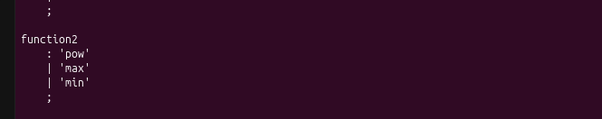
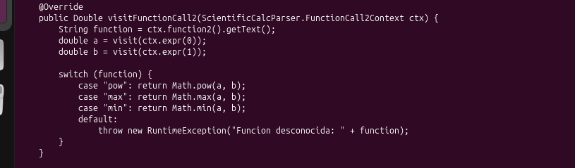
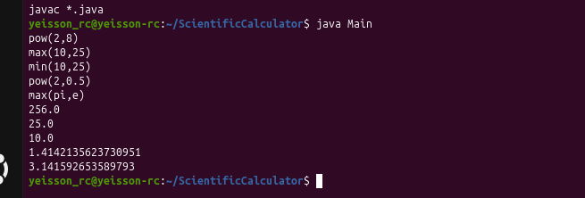

Prueba:
```
pow(2,8)
max(10,25)
min(10,25)
```
Resultados: `256.0`, `25.0`, `10.0`.

### Reto 3 — Rango vertical en `plot` (`plot(expr,xmin,xmax,ymin,ymax)`)

Rango vertical opcional con grupo `(...)?`:

```antlr
| 'plot' '(' expr ',' expr ',' expr (',' expr ',' expr)? ')' NEWLINE   # plotExpr
```

Lista `ctx.expr()` con 3 elementos (automático) o 5 (fijo). Segundo constructor en `PlotWindow.java` con `ymin`/`ymax` y marca de rango fijo:

```java
private boolean rangoFijo;
private double ymin;
private double ymax;

public PlotWindow(List<Double> xs, List<Double> ys, double ymin, double ymax) {
    this.xs = xs;
    this.ys = ys;
    this.rangoFijo = true;
    this.ymin = ymin;
    this.ymax = ymax;
    abrirVentana();
}
```

Selección por conteo en `visitPlotExpr`:

```java
if (ctx.expr().size() == 5) {
    double ymin = visit(ctx.expr(3));
    double ymax = visit(ctx.expr(4));
    new PlotWindow(xs, ys, ymin, ymax);
} else {
    new PlotWindow(xs, ys);
}
```

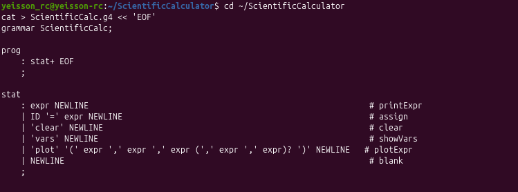
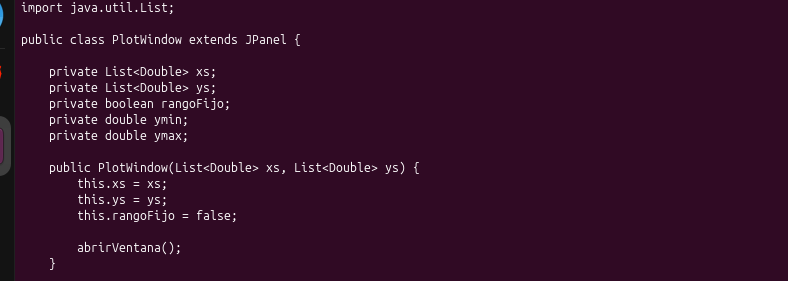
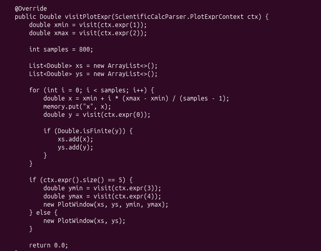
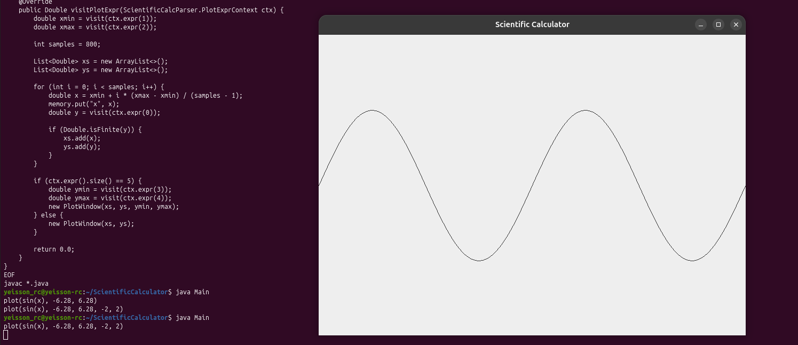

Prueba:
```
plot(sin(x), -6.28, 6.28)
plot(sin(x), -6.28, 6.28, -2, 2)
```
Primera con rango automático (-1 a 1). Segunda con Y entre -2 y 2, curva comprimida. Rango fijo validado.

### Reto 4 — Varias funciones por ventana (`plot(sin(x),cos(x),-6.28,6.28)`)

Separador `;` para funciones, `,` para límites. Sin `;` la coma mezcla funciones y números sin distinción:

```
plot(sin(x); cos(x), -6.28, 6.28)
```

Etiquetas de lista (`funcs+=expr`) + etiquetas simples (`xmin=`, `xmax=`, `ymin=`, `ymax=`):

```antlr
| 'plot' '(' funcs+=expr (';' funcs+=expr)* ',' xmin=expr ',' xmax=expr (',' ymin=expr ',' ymax=expr)? ')' NEWLINE   # plotExpr
```

Acceso directo: `ctx.funcs` (`List<ExprContext>`), `ctx.xmin`, `ctx.xmax`, `ctx.ymin`, `ctx.ymax` (null sin rango).

`PlotWindow.java` con listas de listas (una curva por función) y color por curva:

```java
private static final Color[] COLORES = {
    Color.BLUE, Color.RED, Color.GREEN, Color.ORANGE, Color.MAGENTA
};
```

Límites conjuntos para encuadre simultáneo. Bucle de 800 puntos por función en `visitPlotExpr`:

```java
for (var funcExpr : ctx.funcs) {
    List<Double> xs = new ArrayList<>();
    List<Double> ys = new ArrayList<>();

    for (int i = 0; i < samples; i++) {
        double x = xmin + i * (xmax - xmin) / (samples - 1);
        memory.put("x", x);
        double y = visit(funcExpr);

        if (Double.isFinite(y)) {
            xs.add(x);
            ys.add(y);
        }
    }

    seriesXs.add(xs);
    seriesYs.add(ys);
}
```

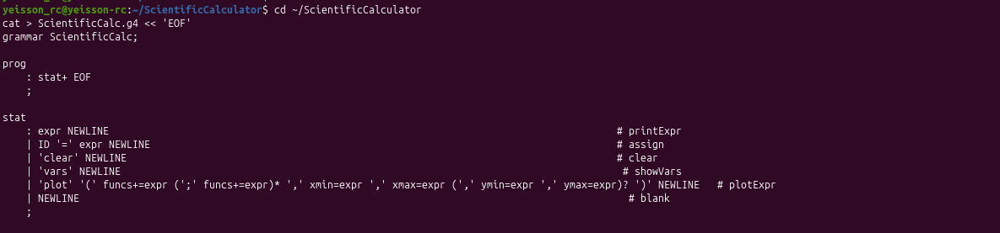
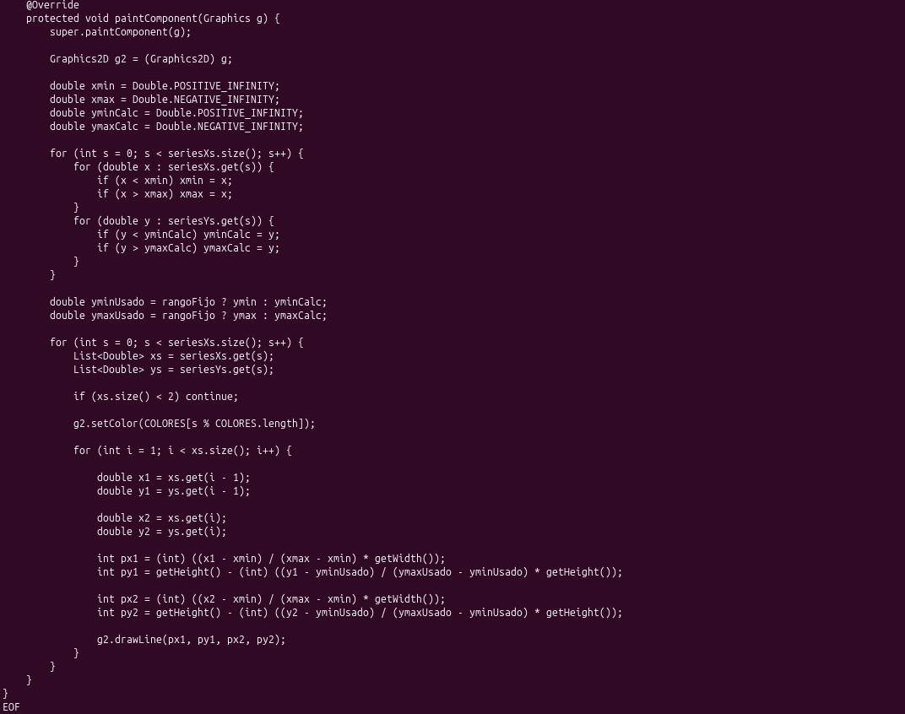
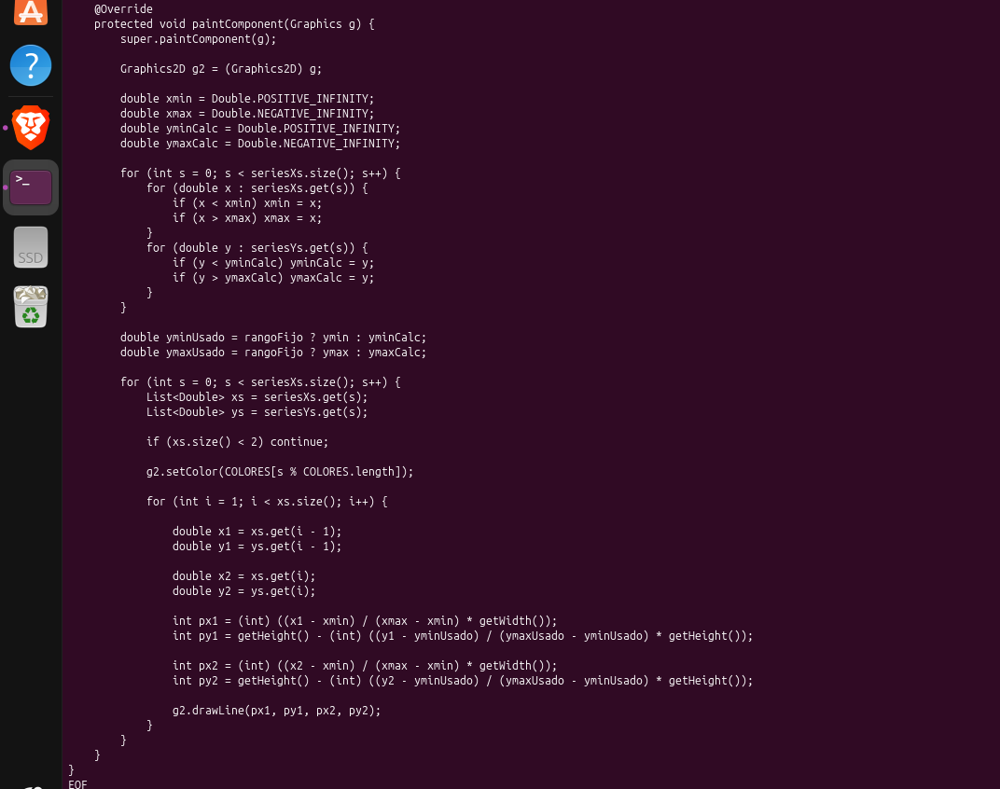
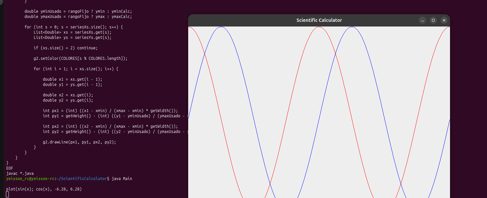
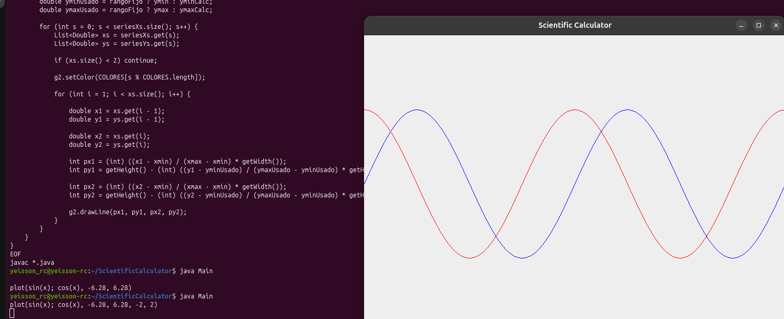

Prueba:
```
plot(sin(x), -6.28, 6.28)
plot(sin(x); cos(x), -6.28, 6.28)
plot(sin(x); cos(x), -6.28, 6.28, -2, 2)
```
Primera con sintaxis simple intacta. Segunda con seno y coseno superpuestos, color por curva. Tercera con combinación reto 3 + rango -2 a 2.

### Reto 5 — Funciones de usuario (`f(x) = x^2 + 2*x + 1`)

Almacenamiento de expresión sin evaluación y evaluación posterior con parámetro variable. Mismo mecanismo de graficación, generalizado fuera de `x`.

Reglas `funcDef` (definición) y `userFunctionCall` (llamada):

```antlr
stat
    : expr NEWLINE                    # printExpr
    | ID '(' ID ')' '=' expr NEWLINE  # funcDef
    | ID '=' expr NEWLINE             # assign
    ...
    ;

expr
    : ...
    | ID '(' expr ')'                 # userFunctionCall
    ...
    ;
```

En `funcDef`, `ctx.ID(0)` = nombre (`f`), `ctx.ID(1)` = parámetro (`x`). Distinción automática frente a asignación (`ID '=' expr`) y llamada (`ID '(' expr ')'`) por forma de tokens, sin ambigüedad.

Mapas en el Visitor: parámetro por función + cuerpo sin evaluar (`ExprContext` para revisita):

```java
Map<String, String> funcParams = new HashMap<>();
Map<String, ScientificCalcParser.ExprContext> funcBodies = new HashMap<>();

@Override
public Double visitFuncDef(ScientificCalcParser.FuncDefContext ctx) {
    String nombreFuncion = ctx.ID(0).getText();
    String nombreParametro = ctx.ID(1).getText();

    funcParams.put(nombreFuncion, nombreParametro);
    funcBodies.put(nombreFuncion, ctx.expr());

    System.out.println("Funcion definida: " + nombreFuncion + "(" + nombreParametro + ")");
    return 0.0;
}
```

Llamada `f(5)` con guardado/restaurado de valor previo del parámetro. Prevención de choque con variable existente (caso típico: `x` de graficación previa):

```java
@Override
public Double visitUserFunctionCall(ScientificCalcParser.UserFunctionCallContext ctx) {
    String nombreFuncion = ctx.ID().getText();

    String nombreParametro = funcParams.get(nombreFuncion);
    ScientificCalcParser.ExprContext cuerpo = funcBodies.get(nombreFuncion);

    double valorArgumento = visit(ctx.expr());

    Double valorPrevio = memory.get(nombreParametro);
    memory.put(nombreParametro, valorArgumento);

    double resultado = visit(cuerpo);

    if (valorPrevio != null) {
        memory.put(nombreParametro, valorPrevio);
    } else {
        memory.remove(nombreParametro);
    }

    return resultado;
}
```

Combinación con graficación y variables sin interferencia.

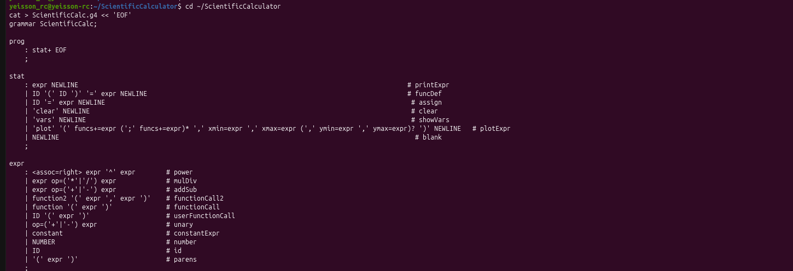
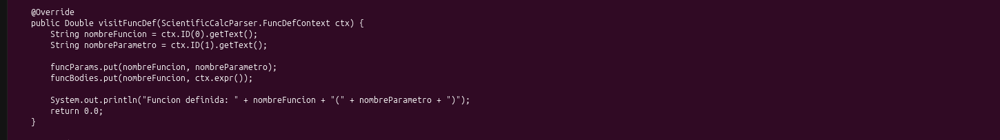
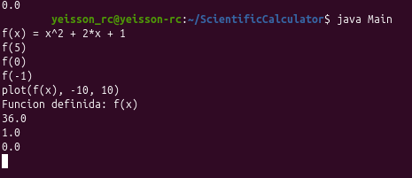
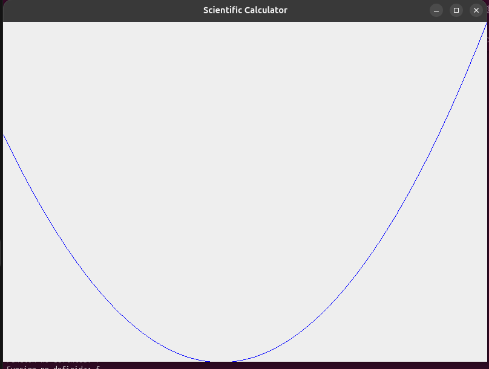

Prueba:
```
f(x) = x^2 + 2*x + 1
f(5)
f(0)
f(-1)
plot(f(x), -10, 10)
```
Resultados: `f(5) = 36.0`, `f(0) = 1.0`, `f(-1) = 0.0` (`f(x) = (x+1)^2`). Parábola con mínimo en `x = -1`. Integración con `plot` al nivel de funciones nativas.
